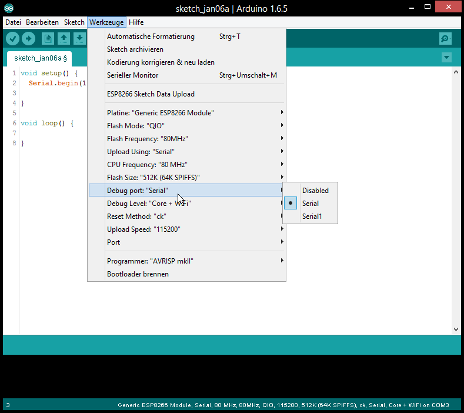
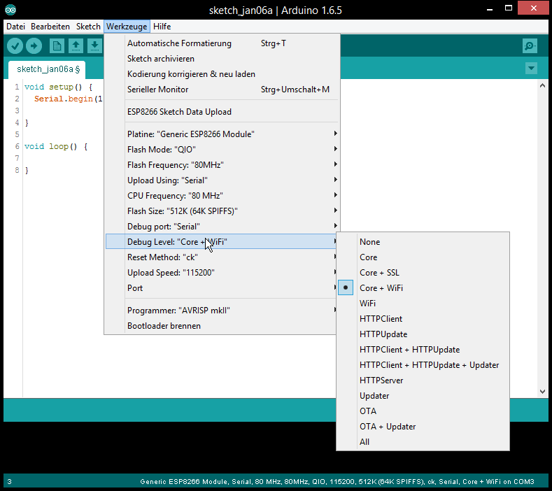

## Table of Contents
  * [Introduction](#introduction)
    * [Requirements](#requirements)
    * [Usage](#Usage)
  * [Informations](#Informations)
    * [For Developers](#for-developers)

## Introduction

Since 2.1.0-rc1 the core includes a Debugging feature that is controllable over the IDE menu.

The new menu points manage the real-time Debug messages.

### Requirements

For usage of the debugging a Serial connection is required (Serial or Serial1).

The Serial Interface need to be initialized in the ```setup()```.

Set the Serial baud rate as high as possible for your Hardware setup.

Minimum sketch to use debugging:
```cpp
void setup() {
    Serial.begin(115200);
}

void loop() {
}
```

### Usage

1. Select the Serial interface for the Debugging messages:


2. Select which type / level you want debug messages for:


3. Check if the Serial interface is initialized in ```setup()``` (see [Requirements](#requirements))

4. Flash sketch

5. Check the Serial Output


## Informations

It work with every sketch that enables the Serial interface that is selected as debug port.

The Serial interface can still be used normal in the Sketch.

The debug output is additional and will not disable any interface from usage in the sketch.

### For Developers 

For the debug handling uses defines.

The defined are set by command line.

#### Debug Port 

The port has the define ```DEBUG_ESP_PORT``` possible value:
 - Disabled: 	define not existing
 - Serial: 		Serial 
 - Serial1: 	Serial1
 
#### Debug Level 

All defines for the different levels starts with ```DEBUG_ESP_```

a full list can be found here in the [boards.txt](https://github.com/esp8266/Arduino/blob/master/boards.txt#L180)

#### Example for own debug messages

The debug messages will be only shown when the Debug Port in the IDE menu is set.

```cpp
#ifdef DEBUG_ESP_PORT
#define DEBUG_MSG(...) DEBUG_ESP_PORT.printf( __VA_ARGS__ )
#else
#define DEBUG_MSG(...) 
#endif

void setup() {
    Serial.begin(115200);
	
	delay(3000);
	DEBUG_MSG("bootup...\n");
}

void loop() {
	DEBUG_MSG("loop %d\n", millis());
	delay(1000);
}
```

