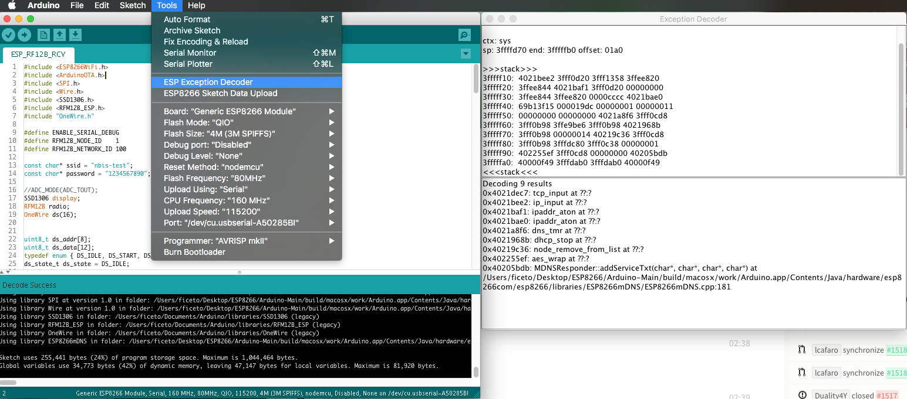

Stack Dumps
===========

Introduction
------------

If the ESP crashes the Exception Cause will be shown and the current stack will be dumped.

Example:

::

    Exception (0): epc1=0x402103f4 epc2=0x00000000 epc3=0x00000000 excvaddr=0x00000000 depc=0x00000000

    ctx: sys
    sp: 3ffffc10 end: 3fffffb0 offset: 01a0

    >>>stack>>>
    3ffffdb0:  40223e00 3fff6f50 00000010 60000600
    3ffffdc0:  00000001 4021f774 3fffc250 4000050c
    3ffffdd0:  400043d5 00000030 00000016 ffffffff
    3ffffde0:  400044ab 3fffc718 3ffffed0 08000000
    3ffffdf0:  60000200 08000000 00000003 00000000
    3ffffe00:  0000ffff 00000001 04000002 003fd000
    3ffffe10:  3fff7188 000003fd 3fff2564 00000030
    3ffffe20:  40101709 00000008 00000008 00000020
    3ffffe30:  c1948db3 394c5e70 7f2060f2 c6ba0c87
    3ffffe40:  3fff7058 00000001 40238d41 3fff6ff0
    3ffffe50:  3fff6f50 00000010 60000600 00000020
    3ffffe60:  402301a8 3fff7098 3fff7014 40238c77
    3ffffe70:  4022fb6c 40230ebe 3fff1a5b 3fff6f00
    3ffffe80:  3ffffec8 00000010 40231061 3fff0f90
    3ffffe90:  3fff6848 3ffed0c0 60000600 3fff6ae0
    3ffffea0:  3fff0f90 3fff0f90 3fff6848 3fff6d40
    3ffffeb0:  3fff28e8 40101233 d634fe1a fffeffff
    3ffffec0:  00000001 00000000 4022d5d6 3fff6848
    3ffffed0:  00000002 4000410f 3fff2394 3fff6848
    3ffffee0:  3fffc718 40004a3c 000003fd 3fff7188
    3ffffef0:  3fffc718 40101510 00000378 3fff1a5b
    3fffff00:  000003fd 4021d2e7 00000378 000003ff
    3fffff10:  00001000 4021d37d 3fff2564 000003ff
    3fffff20:  000003fd 60000600 003fd000 3fff2564
    3fffff30:  ffffff00 55aa55aa 00000312 0000001c
    3fffff40:  0000001c 0000008a 0000006d 000003ff
    3fffff50:  4021d224 3ffecf90 00000000 3ffed0c0
    3fffff60:  00000001 4021c2e9 00000003 3fff1238
    3fffff70:  4021c071 3ffecf84 3ffecf30 0026a2b0
    3fffff80:  4021c0b6 3fffdab0 00000000 3fffdcb0
    3fffff90:  3ffecf40 3fffdab0 00000000 3fffdcc0
    3fffffa0:  40000f49 40000f49 3fffdab0 40000f49
    <<<stack<<<

The first number after ``Exception`` gives the cause of the reset. a
full list of all causes can be found `here <../exception_causes.rst>`__
the hex after are the stack dump.

Decode
~~~~~~

It's possible to decode the Stack to readable information. For more info see the `Esp Exception Decoder <https://github.com/me-no-dev/EspExceptionDecoder>`__ tool.

   ESP Exception Decoder

For more on troubleshooting, read `FAQ: My ESP Crashes <../faq/a02-my-esp-crashes.rst>`__.
