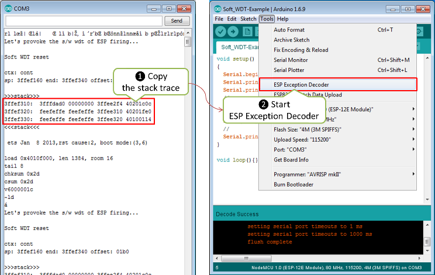
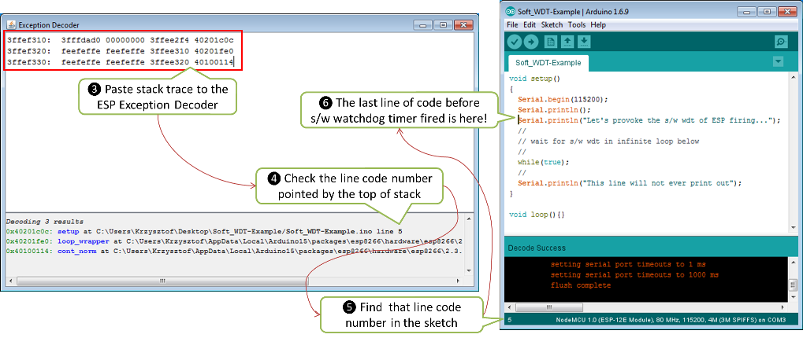

Decoding Stack Dumps
====================

Introduction
------------

If the ESP crashes the Exception Cause will be shown and the current stack will be dumped.

Example:

::

    Exception (0): epc1=0x402103f4 epc2=0x00000000 epc3=0x00000000 excvaddr=0x00000000 depc=0x00000000

    ctx: sys
    sp: 3ffffc10 end: 3fffffb0 offset: 01a0

    >>>stack>>>
    3ffffdb0:  40223e00 3fff6f50 00000010 60000600
    3ffffdc0:  00000001 4021f774 3fffc250 4000050c
    3ffffdd0:  400043d5 00000030 00000016 ffffffff
    3ffffde0:  400044ab 3fffc718 3ffffed0 08000000
    3ffffdf0:  60000200 08000000 00000003 00000000
    3ffffe00:  0000ffff 00000001 04000002 003fd000
    3ffffe10:  3fff7188 000003fd 3fff2564 00000030
    3ffffe20:  40101709 00000008 00000008 00000020
    3ffffe30:  c1948db3 394c5e70 7f2060f2 c6ba0c87
    3ffffe40:  3fff7058 00000001 40238d41 3fff6ff0
    3ffffe50:  3fff6f50 00000010 60000600 00000020
    3ffffe60:  402301a8 3fff7098 3fff7014 40238c77
    3ffffe70:  4022fb6c 40230ebe 3fff1a5b 3fff6f00
    3ffffe80:  3ffffec8 00000010 40231061 3fff0f90
    3ffffe90:  3fff6848 3ffed0c0 60000600 3fff6ae0
    3ffffea0:  3fff0f90 3fff0f90 3fff6848 3fff6d40
    3ffffeb0:  3fff28e8 40101233 d634fe1a fffeffff
    3ffffec0:  00000001 00000000 4022d5d6 3fff6848
    3ffffed0:  00000002 4000410f 3fff2394 3fff6848
    3ffffee0:  3fffc718 40004a3c 000003fd 3fff7188
    3ffffef0:  3fffc718 40101510 00000378 3fff1a5b
    3fffff00:  000003fd 4021d2e7 00000378 000003ff
    3fffff10:  00001000 4021d37d 3fff2564 000003ff
    3fffff20:  000003fd 60000600 003fd000 3fff2564
    3fffff30:  ffffff00 55aa55aa 00000312 0000001c
    3fffff40:  0000001c 0000008a 0000006d 000003ff
    3fffff50:  4021d224 3ffecf90 00000000 3ffed0c0
    3fffff60:  00000001 4021c2e9 00000003 3fff1238
    3fffff70:  4021c071 3ffecf84 3ffecf30 0026a2b0
    3fffff80:  4021c0b6 3fffdab0 00000000 3fffdcb0
    3fffff90:  3ffecf40 3fffdab0 00000000 3fffdcc0
    3fffffa0:  40000f49 40000f49 3fffdab0 40000f49
    <<<stack<<<

The first number after ``Exception`` gives the cause of the reset. a
full list of all causes can be found `here <../exception_causes.rst>`__
the hex after are the stack dump.

Due to the limited resources on the device, our default compiler optimizations
can obfuscate the result. See `how to improve the decoder results <improving_exception_decoder_results.rst>`__.

Decoding
--------

**NOTE:** When decoding exceptions be sure to include **all lines** between
the ``---- CUT HERE ----`` marks in the output to allow the decoder to also
provide the line of code that's actually causing the exception.

ESP Excepton Decoder
^^^^^^^^^^^^^^^^^^^^

Using https://github.com/me-no-dev/EspExceptionDecoder by @me-no-dev

.. figure:: ESP_Exception_Decoderp.png
   :alt: ESP Exception Decoder

   ESP Exception Decoder

`Installation instructions for Arduino IDE 1.x <https://github.com/me-no-dev/EspExceptionDecoder#installation>`__

If you don't have any code for troubleshooting, use the example below:

.. code:: cpp

    void setup()
    {
      Serial.begin(115200);
      Serial.println();
      Serial.println("Let's provoke the s/w wdt firing...");
      //
      // provoke an OOM, will be recorded as the last occurred one
      char* out_of_memory_failure = (char*)malloc(1000000);
      //
      // wait for s/w wdt in infinite loop below
      while(true);
      //
      Serial.println("This line will not ever print out");
    }

    void loop(){}

Enable the Out-Of-Memory (*OOM*) debug option (in the *Tools > Debug Level*
menu), compile/flash/upload this code to your ESP (Ctrl+U) and start Serial
Monitor (Ctrl+Shift+M).  You should shortly see ESP restarting every couple
of seconds and ``Soft WDT reset`` message together with stack trace showing
up on each restart.  Click the Autoscroll check-box on Serial Monitor to
stop the messages scrolling up.  Select and copy the stack trace, including
the ``last failed alloc call: ...`` line, go to the *Tools* and open the
*ESP Exception Decoder*.

   Decode the stack trace, steps 1 and 2

Now paste the stack trace to Exception Decoder's window. At the bottom
of this window you should see a list of decoded lines of sketch you have
just uploaded to your ESP. On the top of the list, like on the top of
the stack trace, there is a reference to the last line executed just
before the software watchdog timer fired causing the ESP's restart.
Check the number of this line and look it up on the sketch. It should be
the line ``Serial.println("Let's provoke the s/w wdt firing...")``, that
happens to be just before ``while(true)`` that made the watchdog fired
(ignore the lines with comments, that are discarded by compiler).

   Decode the stack trace, steps 3 through 6

Armed with `Arduino ESP8266/ESP32 Exception Stack Trace
Decoder <https://github.com/me-no-dev/EspExceptionDecoder>`__ you can
track down where the module is crashing whenever you see the stack trace
dropped. The same procedure applies to crashes caused by exceptions.

Note, to decode the exact line of code where the application
crashed, you need to use ESP Exception Decoder in context of sketch
you have just loaded to the module for diagnosis. Decoder is not
able to correctly decode the stack trace dropped by some other
application not compiled and loaded from your Arduino IDE.

decoder.py script
^^^^^^^^^^^^^^^^^

Core also includes a standalone script that is able to decode

.. code:: console

   $ python3 tools/decoder.py --help
   usage: decoder.py [-h] [--tool {gdb,addr2line}] [--toolchain-path TOOLCHAIN_PATH] firmware_elf [postmortem]

   positional arguments:
     firmware_elf
     postmortem

   options:
     -h, --help            show this help message and exit
     --tool {gdb,addr2line}
     --toolchain-path TOOLCHAIN_PATH
                           Sets path to Xtensa tools, when they are not in PATH

Where 'postmortem' is either path to the file or ``-`` to capture input of some other tool output.

For example

.. code:: cpp

  #include <Arduino.h>

  int* somewhere { nullptr };
  
  void setup() {
      delay(5000);
      Serial.begin(115200);
      Serial.printf("%d\n", *somewhere);
  }
  
  void loop() {
  }

Right after booting, device would print the following to the default serial port

.. code:: console

   --------------- CUT HERE FOR EXCEPTION DECODER ---------------

   Exception (28):
   epc1=0x4020105f epc2=0x00000000 epc3=0x00000000 excvaddr=0x00000000 depc=0x00000000
   
   >>>stack>>>
   
   ctx: cont
   sp: 3ffffe00 end: 3fffffd0 offset: 0190
   3fffff90:  0001c200 0000001c 00000000 402018d9
   3fffffa0:  3fffdad0 00000000 3ffee4bc 40201055
   3fffffb0:  feefeffe feefeffe 3ffee510 40201954
   3fffffc0:  feefeffe feefeffe 3ffe85d8 40100c39
   <<<stack<<<
   
   --------------- CUT HERE FOR EXCEPTION DECODER ---------------

Using default git installation paths and Arduino IDE 2.x

.. code:: console

   $ python3 /home/runner/.arduino15/packages/esp8266com/esp8266/tools/decoder.py \
       --toolchain-path /home/runner/.arduino15/packages/esp8266com/esp8266/tools/xtensa-lx106-elf/ \
       --elf-path /tmp/arduino/sketches/2D54B6F2B852F5DEF454A04EC8FA3CF5/arduino8869.ino.elf \
       stack.txt

   Exception (28) - LoadProhibited: A load referenced a page mapped with an attribute that does not permit loads
   epc1=0x4020105f: setup at /home/runner/dev/arduino8661/src/main.cpp:8
   
   
   0x402018d9: esp_delay at /home/runner/.arduino15/packages/esp8266com/esp8266/cores/esp8266/core_esp8266_main.cpp:158
   0x40201055: setup at /home/runner/dev/arduino8661/src/main.cpp:8
   0x40201954: loop_wrapper() at /home/runner/.arduino15/packages/esp8266com/esp8266/cores/esp8266/core_esp8266_main.cpp:244
   0x40100c39: cont_wrapper at ??:?

Temporary directory location can be found in verbose build log output, see *Preferences > Show verbose output during [✓] compile*

For example

.. code::

   C:\Users\USERNAME\AppData\Local\Temp\arduino\sketches\2D54B6F2B852F5DEF454A04EC8FA3CF5

PlatformIO
^^^^^^^^^^

Use the built-in `'pio device monitor' exception filter <https://docs.platformio.org/en/stable/core/userguide/device/cmd_monitor.html#built-in-filters>` or decoder.py script
