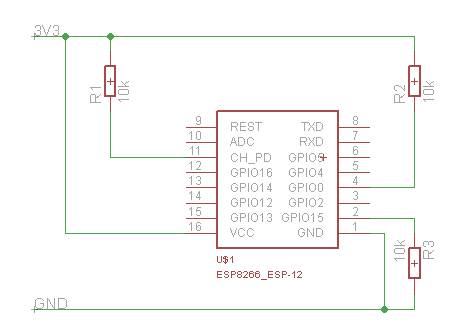
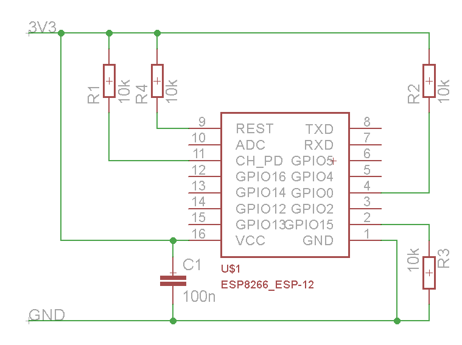

## Table of contents
  * [Adafruit HUZZAH ESP8266 (ESP\-12)](#adafruit-huzzah-esp8266-esp-12)
  * [NodeMCU 0\.9 <a name="user\-content\-nodemcu\-0\-9"></a>](#nodemcu-09-)
    * [Pin mapping](#pin-mapping)
  * [NodeMCU 1\.0](#nodemcu-10)
  * [Olimex MOD\-WIFI\-ESP8266\-DEV](#olimex-mod-wifi-esp8266-dev)
  * [Olimex MOD\-WIFI\-ESP8266](#olimex-mod-wifi-esp8266)
  * [SparkFun ESP8266 Thing](#sparkfun-esp8266-thing)
  * [SweetPea ESP\-210](#sweetpea-esp-210)
  * [ESPino](#espino)
  * [Generic ESP8266 modules](#generic-esp8266-modules)
  * [Serial Adapter](#serial-adapter)
  * [Minimal Hardware Setup for Bootloading and Usage](#minimal-hardware-setup-for-bootloading-and-usage)
  * [ESP to Serial](#esp-to-serial)
    * [Minimal Hardware Setup for Bootloading only](#minimal-hardware-setup-for-bootloading-only)
    * [Minimal Hardware Setup for Running only](#minimal-hardware-setup-for-running-only)
  * [Minimal](#minimal)
  * [Improved Stability](#improved-stability)
  * [Boot Messages and Modes](#boot-messages-and-modes)
    * [rst cause](#rst-cause)
    * [boot mode](#boot-mode)
  * [WeMos D1](#wemos-d1)
  * [WeMos D1 mini](#wemos-d1-mini)

## Adafruit HUZZAH ESP8266 (ESP-12)

*TODO: add notes*

## NodeMCU 0.9

### Pin mapping

Pin numbers written on the board itself do not correspond to ESP8266 GPIO pin numbers. Constants are defined to make using this board easier:

```C++
static const uint8_t D0   = 16;
static const uint8_t D1   = 5;
static const uint8_t D2   = 4;
static const uint8_t D3   = 0;
static const uint8_t D4   = 2;
static const uint8_t D5   = 14;
static const uint8_t D6   = 12;
static const uint8_t D7   = 13;
static const uint8_t D8   = 15;
static const uint8_t D9   = 3;
static const uint8_t D10  = 1;
```

If you want to use NodeMCU pin 5, use D5 for pin number, and it will be translated to 'real' GPIO pin 14.

## NodeMCU 1.0

This module is sold under many names for around $6.50 on AliExpress and it's one of the cheapest, fully integrated ESP8266 solutions.

It's an open hardware design with an ESP-12E core and 4 MB of SPI flash.

Acording to the manufacturer, "with a micro USB cable, you can connect NodeMCU devkit to your laptop and flash it without any trouble". This is more or less true: the board comes with a CP2102 onboard USB to serial adapter which just works, well, the majority of the time. Sometimes flashing fails and you have to reset the board by holding down FLASH + RST, then releasing FLASH, then releasing RST. This forces the CP2102 device to power cycle and to be re-numbered by Linux.

The board also features a NCP1117 voltage regulator, a blue LED on GPIO16 and a 220k/100k Ohm voltage divider on the ADC input pin.

Full pinout and PDF schematics can be found [here](https://github.com/nodemcu/nodemcu-devkit-v1.0)

## Olimex MOD-WIFI-ESP8266-DEV

This board comes with 2 MB of SPI flash and optional accessories (e.g. evaluation board ESP8266-EVB or BAT-BOX for batteries).

The basic module has three solder jumpers that allow you to switch the operating mode between SDIO, UART and FLASH.

The board is shipped for FLASH operation mode, with jumpers TD0JP=0, IO0JP=1, IO2JP=1.

Since jumper IO0JP is tied to GPIO0, which is PIN 21, you'll have to ground it before programming with a USB to serial adapter and reset the board by power cycling it.

UART pins for programming and serial I/O are GPIO1 (TXD, pin 3) and GPIO3 (RXD, pin 4).

Get the board schematics [here](https://github.com/OLIMEX/ESP8266/blob/master/HARDWARE/MOD-WIFI-ESP8266-DEV/MOD-WIFI-ESP8266-DEV_schematic.pdf)

## Olimex MOD-WIFI-ESP8266

This is a stripped down version of the above. Behaves identically in terms of jumpers but has less pins readily available for I/O. Still 2 MB of SPI flash.

## SparkFun ESP8266 Thing ###

Product page: https://www.sparkfun.com/products/13231

*TODO: add notes*

## SweetPea ESP-210

*TODO: add notes*

## ESPino

ESPino integrates the ESP-12 module with a 3.3v regulator, CP2104 USB-Serial bridge and a micro USB connector for easy programming. It is designed for fitting in a breadboard and has an RGB Led and two buttons for easy prototyping.

For more information about the hardware, pinout diagram and programming procedures, please see the [datasheet](https://github.com/makerlabmx/ESPino-tools/raw/master/Docs/ESPino-Datasheet-EN.pdf).

Product page: http://www.espino.io/en

## Generic ESP8266 modules

These modules come in different form factors and pinouts. See the page at ESP8266 community wiki for more info:
[ESP8266 Module Family](http://www.esp8266.com/wiki/doku.php?id=esp8266-module-family).

Usually these modules have no bootstapping resistors on board, insufficient decoupling capacitors, no voltage regulator, no reset circuit, and no USB-serial adapter. This makes using them somewhat tricky, compared to development boards which add these features.

In order to use these modules, make sure to observe the following:

- **Provide sufficient power to the module.** For stable use of the ESP8266 a power supply with 3.3V and >= 250mA is required. Using the power available from USB to Serial adapter is not recommended, these adapters typically do not supply enough current to run ESP8266 reliably in every situation. An external supply or regulator along with filtering capacitors is preferred.

- **Connect bootstapping resistors** to GPIO0, GPIO2, GPIO15 according to the schematics below.

- **Put ESP8266 into bootloader mode** before uploading code.

## Serial Adapter

There are many different USB to Serial adapters / boards.
To be able to put ESP8266 into bootloader mode using serial handshaking lines, you need the adapter which breaks out RTS and DTR outputs. CTS and DSR are not useful for upload (they are inputs). Make sure the adapter can work with 3.3V IO voltage: it should have a jumper or a switch to select between 5V and 3.3V, or be marked as 3.3V only.

Adapters based around the following ICs should work:

 - FT232RL
 - CP2102
 - CH340G

PL2303-based adapters are known not to work on Mac OS X. See https://github.com/igrr/esptool-ck/issues/9 for more info.

## Minimal Hardware Setup for Bootloading and Usage


| PIN           | Resistor | Serial Adapter |
| ------------- | -------- | -------------- |
| VCC           |          | VCC (3.3V)     |
| GND           |          | GND            |
| TX or GPIO2*  |          | RX             |
| RX            |          | TX             |
| GPIO0         | PullUp   | DTR            |
| Reset*        | PullUp   | RTS            |
| GPIO15*       | PullDown |                |
| CH_PD         | PullUp   |                |

* Note
 - GPIO15 is also named MTDO
 - Reset is also named RSBT or REST (adding PullUp improves the stability of the module)
 - GPIO2 is alternative TX for the boot loader mode
 - **Directly connecting a pin to VCC or GND is not a substitute for a PullUp or PullDown resistor, doing this can break upload management and the serial console, instability has also been noted in some cases.**

## ESP to Serial


### Minimal Hardware Setup for Bootloading only ##
ESPxx Hardware

| PIN           | Resistor | Serial Adapter  |
| ------------- | -------- | --------------- |
| VCC           |          | VCC (3.3V)      |
| GND           |          | GND             |
| TX or GPIO2   |          | RX              |
| RX            |          | TX              |
| GPIO0         |          | GND             |
| Reset         |          | RTS*            |
| GPIO15        | PullDown |                 |
| CH_PD         | PullUp   |                 |

* Note
	- if no RTS is used a manual power toggle is needed

### Minimal Hardware Setup for Running only ##

ESPxx Hardware

| PIN           | Resistor | Power supply    |
| ------------- | -------- | --------------- |
| VCC           |          | VCC (3.3V)      |
| GND           |          | GND             |
| GPIO0         | PullUp   |                 |
| GPIO15        | PullDown |                 |
| CH_PD         | PullUp   |                 |

## Minimal


## Improved Stability


## Boot Messages and Modes

The ESP module checks at every boot the Pins 0, 2 and 15.
based on them its boots in different modes:

| GPIO15 | GPIO0 | GPIO2 | Mode                             |
| ------ | ----- | ----- | -------------------------------- |
| 0V     | 0V    | 3.3V  | Uart Bootloader                  |
| 0V     | 3.3V  | 3.3V  | Boot sketch (SPI flash)          |
| 3.3V   | x     | x     | SDIO mode (not used for Arduino) |


at startup the ESP prints out the current boot mode example:
```
rst cause:2, boot mode:(3,6)
```

note:
 - GPIO2 is used as TX output and the internal Pullup is enabled on boot.

### rst cause

| Number | Description            |
| ------ | ---------------------- |
| 0      | unknown                |
| 1      | normal boot            |
| 2      | reset pin              |
| 3      | software reset         |
| 4      | watchdog reset         |


### boot mode

the first value respects the pin setup of the Pins 0, 2 and 15.

| Number | GPIO15 | GPIO0 | GPIO2 | Mode       |
| ------ | ------ | ----- | ----- | ---------- |
| 0      | 0V     | 0V    | 0V    | Not valid  |
| 1      | 0V     | 0V    | 3.3V  | Uart       |
| 2      | 0V     | 3.3V  | 0V    | Not valid  |
| 3      | 0V     | 3.3V  | 3.3V  | Flash      |
| 4      | 3.3V   | 0V    | 0V    | SDIO       |
| 5      | 3.3V   | 0V    | 3.3V  | SDIO       |
| 6      | 3.3V   | 3.3V  | 0V    | SDIO       |
| 7      | 3.3V   | 3.3V  | 3.3V  | SDIO       |

note:
 - number = ((GPIO15 << 2) | (GPIO0 << 1) | GPIO2);

## WeMos D1
Product page: http://wemos.cc

## WeMos D1 mini
Product page: http://wemos.cc
