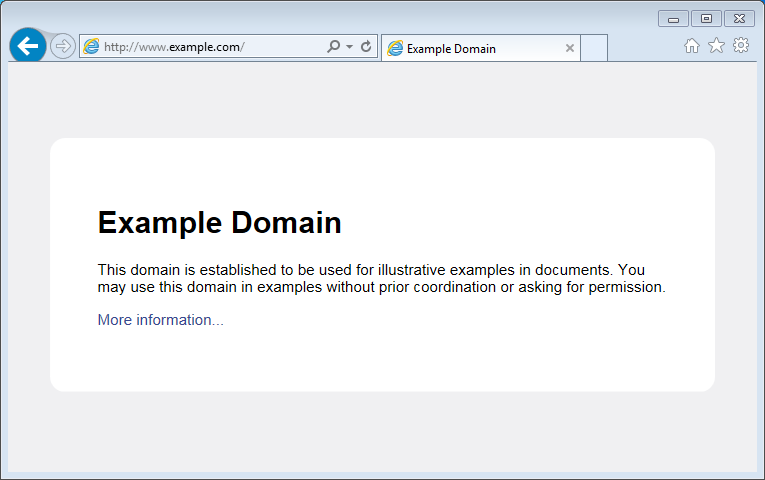

:orphan:

Client
------

Let's write a simple client program to access a single web page and display its contents on a serial monitor. This is typical operation performed by a client to access server's API to retrieve specific information. For instance we may want to contact GitHub's API to periodically check the number of open issues reported on `esp8266/Arduino <https://github.com/esp8266/Arduino/issues>`__ repository.

Table of Contents
-----------------

-  `Introduction <#introduction>`__
-  `Get Connected to Wi-Fi <#get-connected-to-wi-fi>`__
-  `Select a Server <#select-a-server>`__
-  `Instantiate the Client <#instantiate-the-client>`__
-  `Get Connected to the Server <#get-connected-to-the-server>`__
-  `Request the Data <#request-the-data>`__
-  `Read Reply from the Server <#read-reply-from-the-server>`__
-  `Now to the Sketch <#now-to-the-sketch>`__
-  `Test it Live <#test-it-live>`__
-  `Test it More <#test-it-more>`__
-  `Conclusion <#conclusion>`__

Introduction
~~~~~~~~~~~~

This time we are going to concentrate just on retrieving a web page contents sent by a server, to demonstrate basic client's functionality. Once you are able to retrieve information from a server, you should be able to phrase it and extract specific data you need.

Get Connected to Wi-Fi
~~~~~~~~~~~~~~~~~~~~~~

We should start with connecting the module to an access point to obtain an access to internet. The code to provide this functionality has been already discussed in chapter `Quick Start <readme.md#quick-start>`__. Please refer to it for details.

Select a Server
~~~~~~~~~~~~~~~

Once connected to the network we should connect to the specific server. Web address of this server is declared in ``host`` character string as below.

.. code:: cpp

    const char* host = "www.example.com";

I have selected ``www.example.com`` domain name and you can select any other. Just check if you can access it using a web browser.

   alt text

Instantiate the Client
~~~~~~~~~~~~~~~~~~~~~~

Now we should declare a client that will be contacting the host (server):

.. code:: cpp

    WiFiClient client;

Get Connected to the Server
~~~~~~~~~~~~~~~~~~~~~~~~~~~

In next line we will connect to the host and check the connection result. Note ``80``, that is the standard port number used for web access.

.. code:: cpp

    if (client.connect(host, 80))
    {
      // we are connected to the host!
    }
    else
    {
      // connection failure
    }

Request the Data
~~~~~~~~~~~~~~~~

If connection is successful, we should send request the host to provide specific information we need. This is done using the `HTTP GET <https://en.wikipedia.org/wiki/Hypertext_Transfer_Protocol#Request_methods>`__ request as in the following lines:

.. code:: cpp

    client.print(String("GET /") + " HTTP/1.1\r\n" +
                 "Host: " + host + "\r\n" +
                 "Connection: close\r\n" +
                 "\r\n"
                );

Read Reply from the Server
~~~~~~~~~~~~~~~~~~~~~~~~~~

Then, while connection by our client is still alive (``while (client.connected())``, see below) we can read line by line and print out server's response:

.. code:: cpp

    while (client.connected())
    {
      if (client.available())
      {
        String line = client.readStringUntil('\n');
        Serial.println(line);
      }
    }

The inner ``if (client.available())`` is checking if there are any data available from the server. If so, then they are printed out.

Once server sends all requested data it will disconnect and program will exit the ``while`` loop.

Now to the Sketch
~~~~~~~~~~~~~~~~~

Complete sketch, including a case when contention to the server fails, is presented below.

.. code:: cpp

    #include <ESP8266WiFi.h>

    const char* ssid = "********";
    const char* password = "********";

    const char* host = "www.example.com";

    void setup()
    {
      Serial.begin(115200);
      Serial.println();

      Serial.printf("Connecting to %s ", ssid);
      WiFi.begin(ssid, password);
      while (WiFi.status() != WL_CONNECTED)
      {
        delay(500);
        Serial.print(".");
      }
      Serial.println(" connected");
    }

    void loop()
    {
      WiFiClient client;

      Serial.printf("\n[Connecting to %s ... ", host);
      if (client.connect(host, 80))
      {
        Serial.println("connected]");

        Serial.println("[Sending a request]");
        client.print(String("GET /") + " HTTP/1.1\r\n" +
                     "Host: " + host + "\r\n" +
                     "Connection: close\r\n" +
                     "\r\n"
                    );

        Serial.println("[Response:]");
        while (client.connected())
        {
          if (client.available())
          {
            String line = client.readStringUntil('\n');
            Serial.println(line);
          }
        }
        client.stop();
        Serial.println("\n[Disconnected]");
      }
      else
      {
        Serial.println("connection failed!]");
        client.stop();
      }
      delay(5000);
    }

Test it Live
~~~~~~~~~~~~

Upload sketch the module and open serial monitor. You should see a log similar to presented below.

First, after establishing Wi-Fi connection, you should see confirmation, that client connected to the server and send the request:

::

    Connecting to sensor-net ........ connected

    [Connecting to www.example.com ... connected]
    [Sending a request]

Then, after getting the request, server will first respond with a header that specifies what type of information will follow (e.g. ``Content-Type: text/html``), how long it is (like ``Content-Length: 1270``), etc.:

::

    [Response:]
    HTTP/1.1 200 OK

    Cache-Control: max-age=604800
    Content-Type: text/html
    Date: Sat, 30 Jul 2016 12:30:45 GMT
    Etag: "359670651+ident"
    Expires: Sat, 06 Aug 2016 12:30:45 GMT
    Last-Modified: Fri, 09 Aug 2013 23:54:35 GMT
    Server: ECS (ewr/15BD)
    Vary: Accept-Encoding
    X-Cache: HIT
    x-ec-custom-error: 1
    Content-Length: 1270
    Connection: close

End of header is marked with an empty line and then you should see the HTML code of requested web page.

::

    <!doctype html>
    <html>
    <head>
        <title>Example Domain</title>

        <meta charset="utf-8" />
        <meta http-equiv="Content-type" content="text/html; charset=utf-8" />
        <meta name="viewport" content="width=device-width, initial-scale=1" />
        <style type="text/css">

    (...)

    </head>

    <body>
    

        <h1>Example Domain</h1>
        
This domain is established to be used for illustrative examples in documents. You may use this
        domain in examples without prior coordination or asking for permission.

        
<a href="http://www.iana.org/domains/example">More information...</a>

    

    </body>
    </html>

    [Disconnected]

Test it More
~~~~~~~~~~~~

In case server's web address is incorrect, or server is not accessible, you should see the following short and simple message on the serial monitor:

::

    Connecting to sensor-net ........ connected

    [Connecting to www.wrong-example.com ... connection failed!]

Conclusion
~~~~~~~~~~

With this simple example we have demonstrated how to set up a client program, connect it to a server, request a web page and retrieve it. Now you should be able to write your own client program for ESP8266 and move to more advanced dialogue with a server, like e.g. using `HTTPS <https://en.wikipedia.org/wiki/HTTPS>`__ protocol with the `Client Secure <readme.md#client-secure>`__.

For more client examples please check

- `WiFiClientBasic.ino <https://github.com/esp8266/Arduino/blob/master/libraries/ESP8266WiFi/examples/WiFiClientBasic/WiFiClientBasic.ino>`__ - a simple sketch that sends a message to a TCP server

- `WiFiClient.ino <https://github.com/esp8266/Arduino/blob/master/libraries/ESP8266WiFi/examples/WiFiClient/WiFiClient.ino>`__ - this sketch sends data via HTTP GET requests to data.sparkfun.com service.

For the list of functions provided to manage clients, please refer to the `Client Class :arrow\_right: <client-class.md>`__ documentation.
