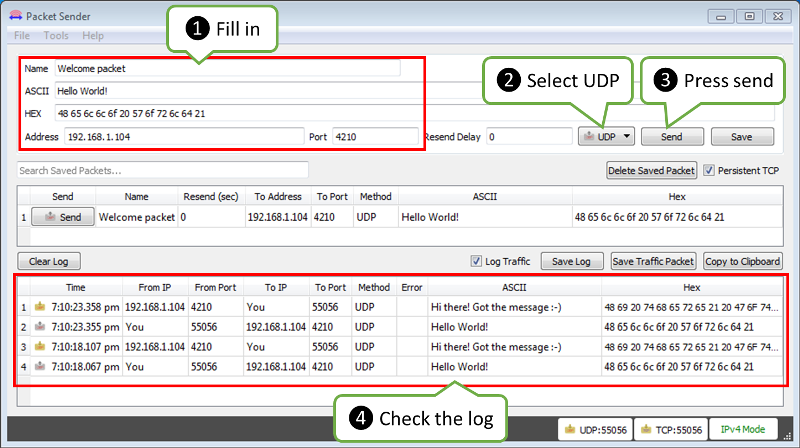

:orphan:

UDP
---

The purpose of example application below is to demonstrate UDP communication between ESP8266 and an external client. The application (performing the role of a server) is checking inside the ``loop()`` for an UDP packet to arrive. When a valid packet is received, an acknowledge packet is sent back to the client to the same port it has been sent out.

Table of Contents
-----------------

-  `Declarations <#declarations>`__
-  `Wi-Fi Connection <#wi-fi-connection>`__
-  `UDP Setup <#udp-setup>`__
-  `An UDP Packet Arrived! <#an-udp-packet-arrived>`__
-  `An Acknowledge Send Out <#an-acknowledge-send-out>`__
-  `Complete Sketch <#complete-sketch>`__
-  `How to Check It? <#how-to-check-it>`__
-  `Conclusion <#conclusion>`__

Declarations
~~~~~~~~~~~~

At the beginning of sketch we need to include two libraries:

.. code:: cpp

    #include <ESP8266WiFi.h>
    #include <WiFiUdp.h>

The first library ``ESP8266WiFi.h`` is required by default if we are using ESP8266's Wi-Fi. The second one ``WiFiUdp.h`` is needed specifically for programming of UDP routines.

Once we have libraries in place we need to create a ``WiFiUDP`` object. Then we should specify a port to listen to incoming packets. There are conventions on usage of port numbers, for information please refer to the `List of TCP and UDP port numbers <https://en.wikipedia.org/wiki/List_of_TCP_and_UDP_port_numbers>`__. Finally we need to set up a buffer for incoming packets and define a reply message.

.. code:: cpp

    WiFiUDP Udp;
    unsigned int localUdpPort = 4210;
    char incomingPacket[255];
    char replyPacket[] = "Hi there! Got the message :-)";

Wi-Fi Connection
~~~~~~~~~~~~~~~~

At the beginning of ``setup()`` let's implement typical code to connect to an access point. This has been discussed in `Quick Start <readme.rst#quick-start>`__. Please refer to it if required.

UDP Setup
~~~~~~~~~

Once connection is established, you can start listening to incoming packets.

.. code:: cpp

    Udp.begin(localUdpPort);

That is all required preparation. We can move to the ``loop()`` that will be handling actual UDP communication.

An UDP Packet Arrived!
~~~~~~~~~~~~~~~~~~~~~~

Waiting for incoming UDP packed is done by the following code:

.. code:: cpp

    int packetSize = Udp.parsePacket();
    if (packetSize)
    {
      Serial.printf("Received %d bytes from %s, port %d\n", packetSize, Udp.remoteIP().toString().c_str(), Udp.remotePort());
      int len = Udp.read(incomingPacket, 255);
      if (len > 0)
      {
        incomingPacket[len] = 0;
      }
      Serial.printf("UDP packet contents: %s\n", incomingPacket);

      (...)
    }

Once a packet is received, the code will printing out the IP address and port of the sender as well as the length of received packet. If the packet is not empty, its contents will be printed out as well.

An Acknowledge Send Out
~~~~~~~~~~~~~~~~~~~~~~~

For each received packet we are sending back an acknowledge packet:

.. code:: cpp

    Udp.beginPacket(Udp.remoteIP(), Udp.remotePort());
    Udp.write(replyPacket);
    Udp.endPacket();

Please note we are sending reply to the IP and port of the sender by using ``Udp.remoteIP()`` and ``Udp.remotePort()``.

Complete Sketch
~~~~~~~~~~~~~~~

The sketch performing all described functionality is presented below:

.. code:: cpp

    #include <ESP8266WiFi.h>
    #include <WiFiUdp.h>

    const char* ssid = "********";
    const char* password = "********";

    WiFiUDP Udp;
    unsigned int localUdpPort = 4210;  // local port to listen on
    char incomingPacket[255];  // buffer for incoming packets
    char  replyPacket[] = "Hi there! Got the message :-)";  // a reply string to send back

    void setup()
    {
      Serial.begin(115200);
      Serial.println();

      Serial.printf("Connecting to %s ", ssid);
      WiFi.begin(ssid, password);
      while (WiFi.status() != WL_CONNECTED)
      {
        delay(500);
        Serial.print(".");
      }
      Serial.println(" connected");

      Udp.begin(localUdpPort);
      Serial.printf("Now listening at IP %s, UDP port %d\n", WiFi.localIP().toString().c_str(), localUdpPort);
    }

    void loop()
    {
      int packetSize = Udp.parsePacket();
      if (packetSize)
      {
        // receive incoming UDP packets
        Serial.printf("Received %d bytes from %s, port %d\n", packetSize, Udp.remoteIP().toString().c_str(), Udp.remotePort());
        int len = Udp.read(incomingPacket, 255);
        if (len > 0)
        {
          incomingPacket[len] = 0;
        }
        Serial.printf("UDP packet contents: %s\n", incomingPacket);

        // send back a reply, to the IP address and port we got the packet from
        Udp.beginPacket(Udp.remoteIP(), Udp.remotePort());
        Udp.write(replyPacket);
        Udp.endPacket();
      }
    }

How to Check It?
~~~~~~~~~~~~~~~~

Upload sketch to module and open serial monitor. You should see confirmation that ESP has connected to Wi-Fi and started listening to UDP packets:

::

    Connecting to twc-net-3 ........ connected
    Now listening at IP 192.168.1.104, UDP port 4210

Now we need another application to send some packets to IP and port shown by ESP above.

Instead of programming another ESP, let's make it easier and use a purpose build application. I have selected the `Packet Sender <https://packetsender.com/download>`__. It is available for popular operating systems. Download, install and execute it.

Once Packet Sender's window show up enter the following information: \* *Name* of the packet \* *ASCII* text of the message to be send inside the packet \* IP *Address* shown by our ESP \* *Port* shown by the ESP
\* Select *UDP*

What I have entered is shown below:

Now click *Send*.

Immediately after that you should see the following on ESP's serial monitor:

::

    Received 12 bytes from 192.168.1.106, port 55056
    UDP packet contents: Hello World!

The text ``192.168.1.106, port 55056`` identifies a PC where the packet is send from. You will likely see different values.

As ESP sends an acknowledge packet back, you should see it in the log in the bottom part of the Packet Sender's window.

Conclusion
~~~~~~~~~~

This simple example shows how to send and receive UDP packets between ESP and an external application. Once tested in this minimal set up, you should be able to program ESP to talk to any other UDP device. In case of issues to establish communication with a new device, use the `Packet Sender <https://packetsender.com>`__ or other similar program for troubleshooting

For review of functions provided to send and receive UDP packets, please refer to the `UDP Class <udp-class.rst>`__ documentation.
