:orphan:

I am getting "espcomm\_sync failed" error when trying to upload my ESP. How to resolve this issue?
--------------------------------------------------------------------------------------------------

-  `Introduction <#introduction>`__
-  `Initial Checks <#initial-checks>`__
-  `Advanced Checks <#advanced-checks>`__
-  `Reset Methods <#reset-methods>`__
-  `Ck <#ck>`__
-  `Nodemcu <#nodemcu>`__
-  `I'm Stuck <#im-stuck>`__
-  `Conclusion <#conclusion>`__

Introduction
~~~~~~~~~~~~

This message indicates issue with uploading ESP module over a serial
connection. There are couple of possible causes, that depend on the type
of module, if you use separate USB to serial converter, what parameters
are selected for upload, etc. As result there is no single answer on the
root cause. To find it out you may need to complete couple of
troubleshooting steps.

    Note: If you are just starting with ESP, to reduce potential issues
    with uploading, select ESP board with integrated USB to serial
    converter. This will considerably reduce number of user depended
    factors or configuration settings that influence upload process.

Example boards with USB to serial converter build in, that will make
your initial project development easier, are shown below.

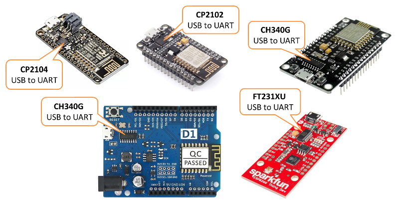

   Example boards with integrated USB to serial converter

If you are using a Generic ESP8266 module, separate USB to serial
converter and connect them by yourself, please make sure you have the
following three things right: 1. Module is provided with enough power,
2. GPIO0, GPIO15 and CH\_PD are connected using pull up / pull down
resistors, 3. Module is put into boot loader mode.

For specific details please refer to section on `Generic ESP8266 module <../boards.rst#generic-esp8266-module>`__.
Example modules without USB to serial converter on board are shown below.

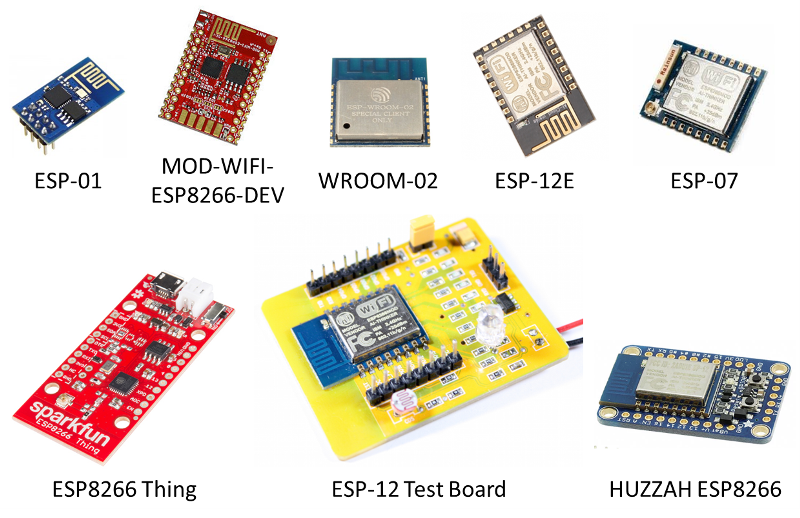

   Example ESP8266 modules without USB to serial converter

Initial Checks
~~~~~~~~~~~~~~

In order to troubleshoot "espcomm\_sync failed" error, please proceed
step by step through the checklist below. This list is organized
starting with most common and simple to more complex issues.

1. Start with reading exact message displayed in debug window of Arduino
   IDE. In many cases it provides direct information where the issue is.

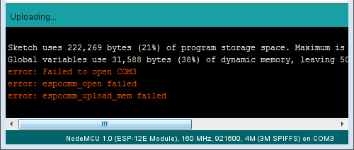

   "espcomm\_open failed" error

For instance message above suggests that Arduino IDE is unable to open a
serial port COM3. Check if you have selected port where your module is
connected to.

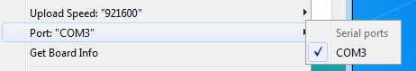

   Serial port selection

2. If a module is connected to the serial port but not responding as a
   valid ESP8266 device, the message will read slightly different (see
   below). If you have other modules connected to your PC, make sure
   that you are uploading code to ESP8266 and not to e.g. Arduino UNO.

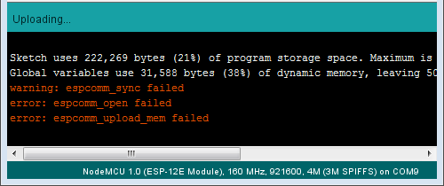

   Serial port selection

3. To have your PC talking to ESP, select exact ESP type in upload menu.
   If selection is incorrect then the upload may fail.

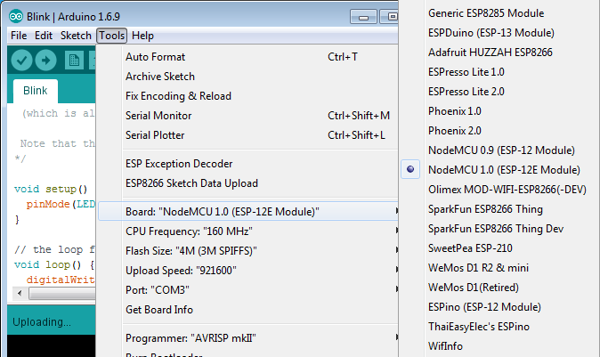

   Board selection

Basing on selected board type, Arduino IDE will apply specific "reset
method" to enter the board into boot loading mode. Reset methods are
board specific. Some boards do not have the h/w in place to support
reset by Arduino IDE. If this is the case, you need to enter such board
into boot loading mode manually.

4. Upload may be also failing due to too high speed. If you have long or
   poor quality USB cable, try reducing selection under *Upload Speed*.

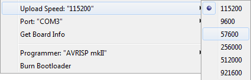

   Serial speed selection

Advanced Checks
~~~~~~~~~~~~~~~

1. If you are still facing issues, test if module is indeed entering the
   boot loading mode. You can do it by connecting secondary USB to
   serial converter and checking the message displayed. Attach RX and
   GND pins of converter to TX and GND pin of ESP as shown on example
   below (`get fzz
   source <pictures/a01-secondary-serial-hookup.fzz>`__).

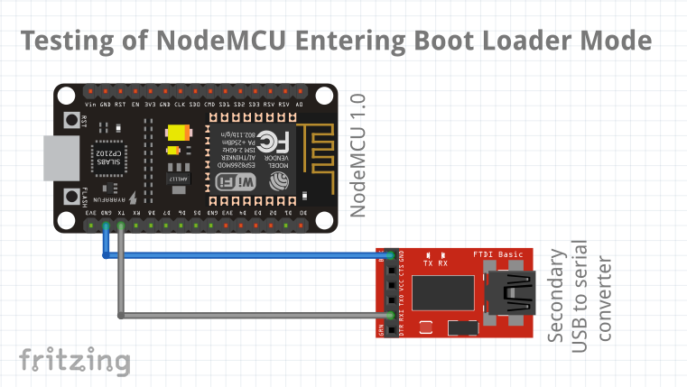

   Secondary USB to serial converter hookup

Then open a terminal at 74880 baud, and look what message is reported
when ESP is being reset for programming. Correct message looks as
follows:

``ets Jan  8 2013,rst cause:2, boot mode:(1,7)``

If you see similar message but different values then decode them using
`Boot Messages and Modes <../boards.rst#boot-messages-and-modes>`__. The
key information is contained in first digit / three right-most bits of
the boot mode message as shown below.

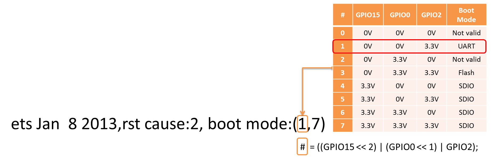

   Decoding of boot mode

For instance message ``boot mode (3,3)`` indicates that pins GPIO2 and
GPIO0 are set HIGH and GPIO15 is set LOW. This is configuration for
`normal
operation <../boards.rst#minimal-hardware-setup-for-running-only>`__ of
module (to execute application from flash), not for `boot
loading <../boards.rst#minimal-hardware-setup-for-bootloading-only>`__
(flash programming).

    Note: Without having this step right you will not be able to upload
    your module over a serial port.

2. You have confirmed that module is in boot loading mode but upload
   still fails. If you are using external USB to serial converter, then
   check if it operates correctly by looping it back. This is quite
   simple check. Just connect TX and RX of your converter together like
   on picture below. Then open Serial Monitor and type some characters.
   If everything is fine, then you should see what you type immediately
   printed back on the monitor. For an ESP with USB to serial converter
   on board, this check may involve breaking some PCB traces. I would
   not do it unless being desperate. Instead try steps below.

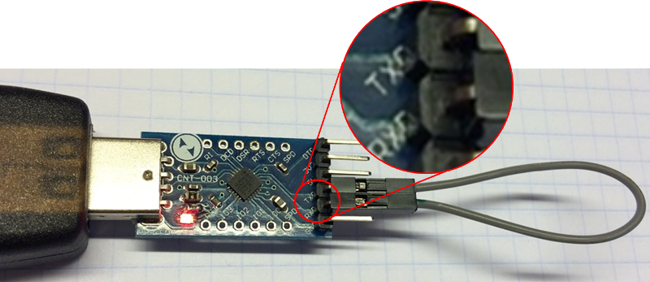

   USB to serial converter loop back

3. Next step to try, if not done already, is checking detailed debug
   messages. Go to *File > Preferences*, enable *Show verbose output
   during: upload* and try uploading again. For successful upload this
   log should look similar to example shown below:

``C:\Users\Krzysztof\AppData\Local\Arduino15\packages\esp8266\tools\esptool\0.4.8/esptool.exe -vv -cd ck -cb 115200 -cp COM3 -ca 0x00000 -cf C:\Users\KRZYSZ~1\AppData\Local\Temp\build7e44b372385012e74d64fb272d24b802.tmp/Blink.ino.bin    esptool v0.4.8 - (c) 2014 Ch. Klippel <ck@atelier-klippel.de>       setting board to ck       setting baudrate from 115200 to 115200       setting port from COM1 to COM3       setting address from 0x00000000 to 0x00000000       espcomm_upload_file       espcomm_upload_mem       setting serial port timeouts to 1000 ms   opening bootloader   resetting board   trying to connect       flush start       setting serial port timeouts to 1 ms       setting serial port timeouts to 1000 ms       flush complete       espcomm_send_command: sending command header       espcomm_send_command: sending command payload       read 0, requested 1   trying to connect       flush start       setting serial port timeouts to 1 ms       setting serial port timeouts to 1000 ms       flush complete       espcomm_send_command: sending command header       espcomm_send_command: sending command payload       espcomm_send_command: receiving 2 bytes of data       espcomm_send_command: receiving 2 bytes of data       espcomm_send_command: receiving 2 bytes of data       espcomm_send_command: receiving 2 bytes of data       espcomm_send_command: receiving 2 bytes of data       espcomm_send_command: receiving 2 bytes of data       espcomm_send_command: receiving 2 bytes of data       espcomm_send_command: receiving 2 bytes of data   Uploading 226368 bytes from to flash at 0x00000000       erasing flash       size: 037440 address: 000000       first_sector_index: 0       total_sector_count: 56       head_sector_count: 16       adjusted_sector_count: 40       erase_size: 028000       espcomm_send_command: sending command header       espcomm_send_command: sending command payload       setting serial port timeouts to 15000 ms       setting serial port timeouts to 1000 ms       espcomm_send_command: receiving 2 bytes of data       writing flash   ..............................................................................................................................................................................................................................   starting app without reboot       espcomm_send_command: sending command header       espcomm_send_command: sending command payload       espcomm_send_command: receiving 2 bytes of data   closing bootloader       flush start       setting serial port timeouts to 1 ms       setting serial port timeouts to 1000 ms       flush complete``

Upload log may be longer depending on number of connection attempts made
by esptool. Analyze it for any anomalies to configuration you have
selected in Arduino IDE, like different serial port, reset method, baud
rate, etc. Resolve all noted differences.

Reset Methods
~~~~~~~~~~~~~

If you got to this point and still see ``espcomm_sync failed``, then now
you need to bring in the heavy guns.

Connect scope or logic analyzer to GPIO0, RST and RXD pins of the ESP to
check what's happening.

Then compare your measurements with wave-forms collected for circuits
below. They document two standard methods of resetting ESP8266 for
upload, that you can select in Arduino IDE - `ck <#ck>`__ and
`nodemcu <#nodemcu>`__.

Ck
^^

Circuit below has been prepared to collect wave-forms for ck reset
method (`get fzz source <pictures/a01-circuit-ck-reset.fzz>`__). It is
simpler than for `nodemcu <#nodemcu>`__ reset and therefore often used
to wire up generic ESP modules on a breadboard. Check it against your
wiring when comparing your measurements against wave-forms below.

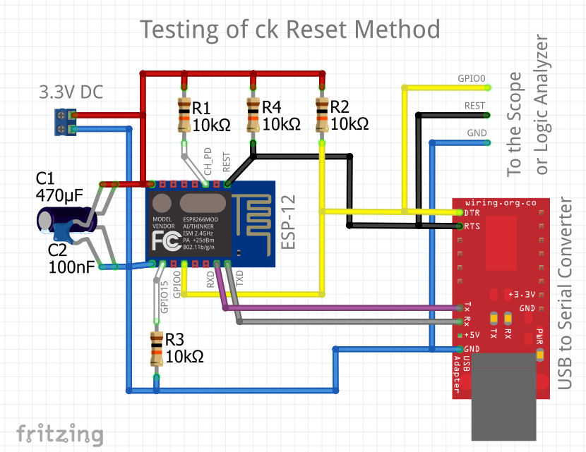

   Sample circuit to check ck method

The following wave-forms below show voltage signals on GPIO0 and RST
pins of the ESP board when uploading the firmware.

Close up of ck reset method signal sequence at the beginning of upload
is shown below.

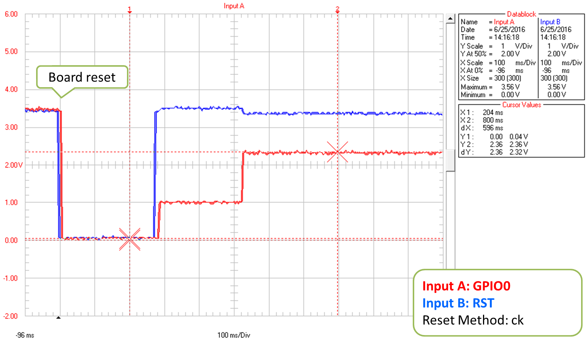

   Reset Method: ck, close up at the beginning of upload

Next picture shows complete upload of
`Blink.ino <https://github.com/esp8266/Arduino/blob/master/libraries/esp8266/examples/Blink/Blink.ino>`__
example at 921600 baud. This is quite high speed, so the upload takes
only about 8s.

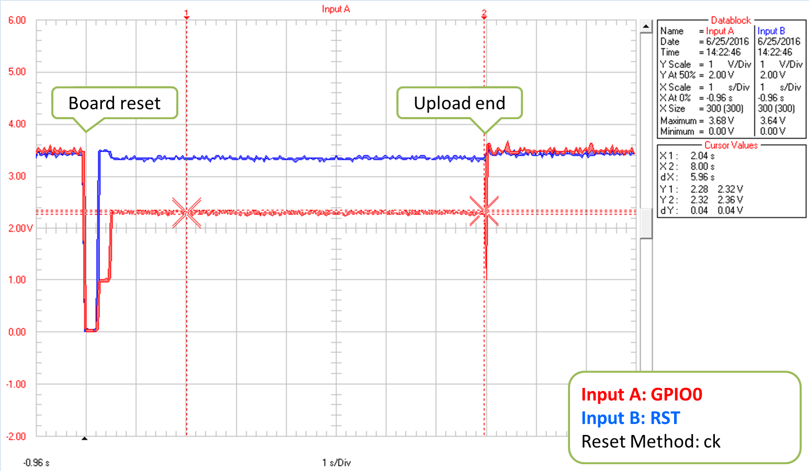

   Reset Method: ck, complete upload

Please note that when esptool is not able to initialize upload at the
first time, then it retries reset procedure. Case of one such retry is
shown on wave-form below.

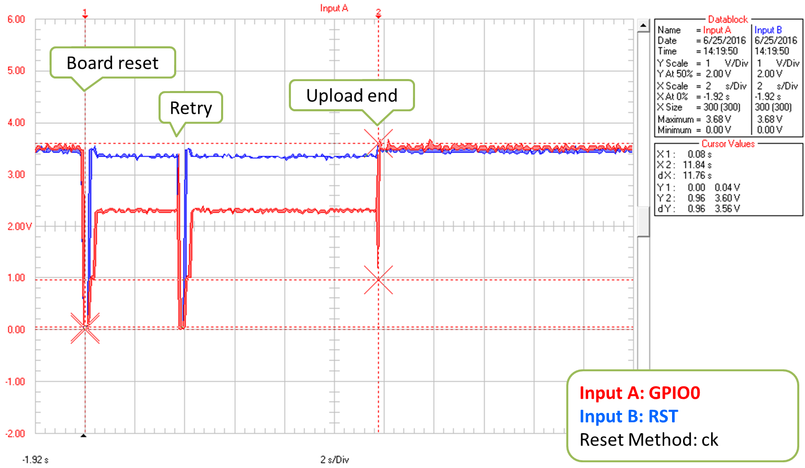

   Reset Method: ck, complete upload

Each retry is reported in upload log as follows:

::

    resetting board
    trying to connect
        flush start
        setting serial port timeouts to 1 ms
        setting serial port timeouts to 1000 ms
        flush complete
        espcomm_send_command: sending command header
        espcomm_send_command: sending command payload
        read 0, requested 1

Presented circuit has one important limitation when it comes to work
with Arduino IDE. After opening Serial Monitor (Ctrl-Shift-M), both RTS
and DTR lines are permanently pulled down. As RTS line is connected to
REST input of ESP, the module is hold in reset state / not able to run.
Therefore after uploading module, you need to disconnect both lines or
use different serial terminal program that is not pulling down RTS and
DTR lines. Otherwise the module will get stuck waiting for releasing the
REST signal and you will see nothing on the Serial Monitor.

As for different serial terminal program you can check Arduino IDE
add-on `Serial Monitor for
ESP8266 <https://github.com/esp8266/Arduino/issues/1360>`__ developed
by user [@mytrain](https://github.com/mytrain) and discussed in
`#1360 <https://github.com/esp8266/Arduino/issues/1360>`__.

If you prefer external terminal program, then for Windows users we can
recommend free and handy
`Termite <https://www.compuphase.com/software_termite.htm>`__.

Nodemcu
^^^^^^^

Nodemcu reset method is named after
`NodeMCU <https://github.com/nodemcu/nodemcu-devkit>`__ board where it
has been introduced for the first time. It overcomes limitations with
handling of RTS and DTR lines discussed for `ck <#ck>`__ reset method
above.

Sample circuit to measure wave-form is shown below (`get fzz
source <pictures/a01-circuit-nodemcu-reset.fzz>`__).

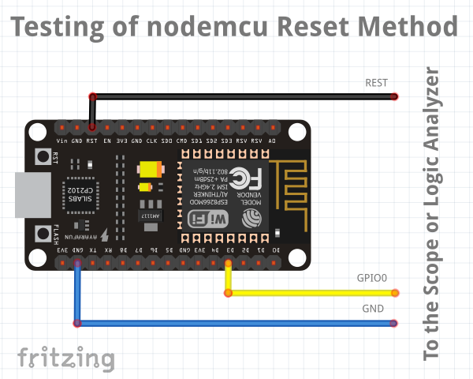

   Sample circuit to check nodemcu reset method

Close up of voltage signals on GPIO0 and RST pins at the beginning of
firmware upload is shown below.

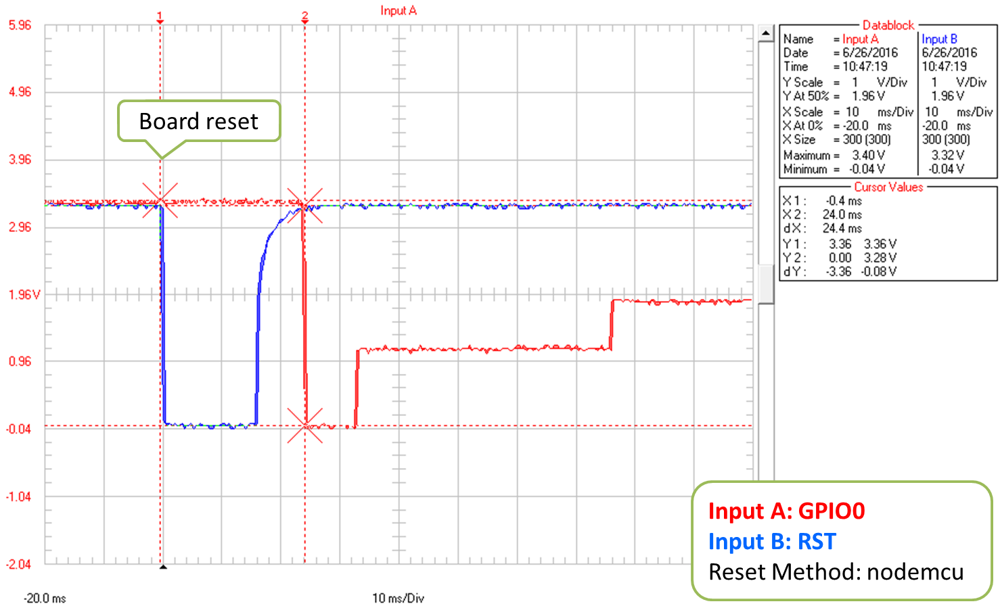

   Reset Method: nodemcu, close up at the beginning of upload

Please note that the reset sequence is about 10x shorter comparing to
`ck <#ck>`__ reset (about 25ms vs. 250ms).

Next picture covers complete upload of
`Blink.ino <https://github.com/esp8266/Arduino/blob/master/libraries/esp8266/examples/Blink/Blink.ino>`__
example at 921600 baud. Except for difference of the reset signal
sequence, the complete upload looks similar to that of `ck <#ck>`__.

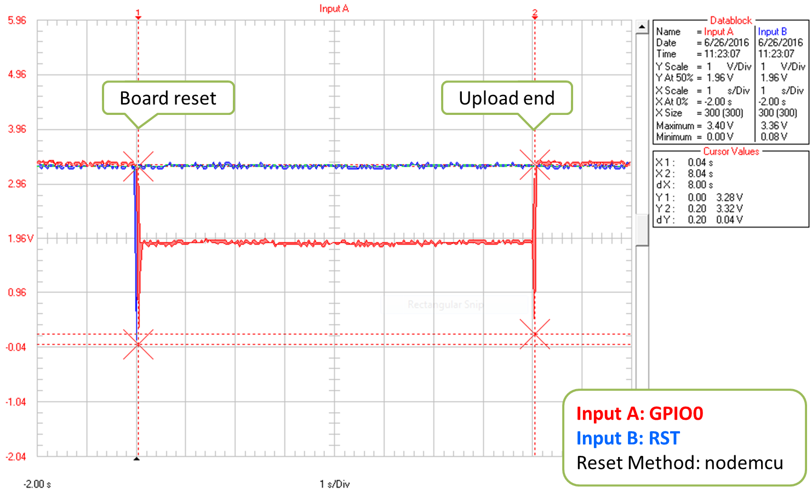

   Reset Method: nodemcu, complete upload

A sample wave-form below shows another upload of
`Blink.ino <https://github.com/esp8266/Arduino/blob/master/libraries/esp8266/examples/Blink/Blink.ino>`__
example at 921600 baud, but with two reset retries.

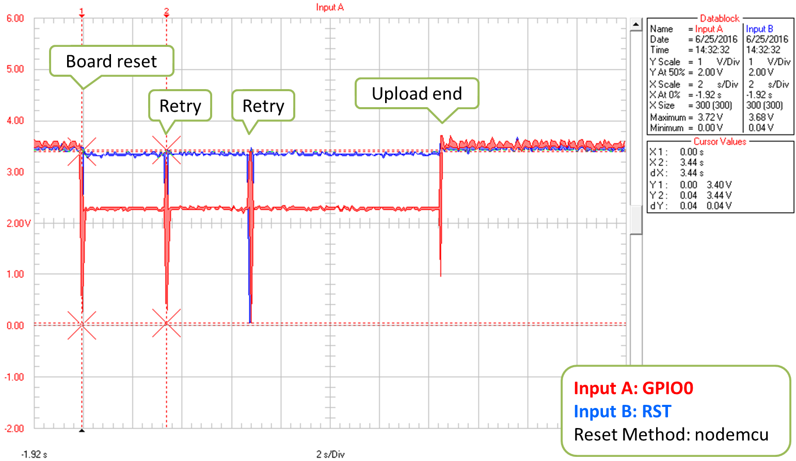

   Reset Method: nodemcu, reset retries

If you are interested how nodemcu reset method is implemented, then
check circuit below. As indicated it does not pull to ground RTS and DTR
lines once you open Serial Monitor in Arduino IDE.

.. figure:: pictures/a01-nodemcu-reset-implementation.png
   :alt: Implementation of nodemcu reset

   Implementation of nodemcu reset

It consists of two transistors and resistors that you can locate on
NodeMCU board on right. On left you can see complete circuit and the
truth table how RTS and DTR signals of the serial interface are
translated to RST and GPIO0 on the ESP. For more details please refer to
`nodemcu <https://github.com/nodemcu/nodemcu-devkit>`__ repository on
GitHub.

I'm Stuck
~~~~~~~~~

Hopefully at this point you were able to resolve ``espcomm_sync failed`` issue and now enjoy quick and reliable uploads of your ESP modules.

If this is still not the case, then review once more all discussed steps in the checklist below.

**Initial Checks**

* [ ] Is your module connected to serial port and visible in IDE?

* [ ] Is connected device responding to IDE? What is exact message in debug window?

* [ ] Have you selected correct ESP module type in *Board* menu? What is the selection?

* [ ] Have you tried to reduce upload speed? What speeds have you tried?

**Advanced Checks**

* [ ] What message is reported by ESP at 74880 baud when entering boot loading mode?

* [ ] Have you checked your USB to serial converter by looping it back? What is the result?

* [ ] Is your detailed upload log consistent with settings in IDE? What is the log?

**Reset Method**

* [ ] What reset method do you use?

* [ ] What is your connection diagram? Does it match diagram in this FAQ?

* [ ] What is your wave-form of board reset? Does it match wave-form in this FAQ?

* [ ] What is your wave-form of complete upload? Does it match wave-form in this FAQ?

**Software**

* [ ] Do you use the latest stable version of `esp8266 / Arduino <https://github.com/esp8266/Arduino>`__? What is it?

* [ ] What is the name and version of your IDE and O/S?

If you are stuck at certain step, then post this list on `ESP8266 Community Forum <https://www.esp8266.com/>`__ asking for support.

Conclusion
~~~~~~~~~~

With variety of available ESP8266 modules and boards, as well as
possible connection methods, troubleshooting of upload issues may take
several steps.

If you are a beginner, then use boards with integrated power supply and
USB to serial converter. Check carefully message in debug window and act
accordingly. Select your exact module type in IDE and try to adjust
upload speed. Check if board is indeed entering boot loading mode. Check
operation of your USB to serial converter with loop back. Analyze
detailed upload log for inconsistencies with IDE settings.

Verify your connection diagram and wave-form for consistency with
selected reset method.

If you get stuck, then ask `community <https://www.esp8266.com/>`__ for
support providing summary of all completed checks.

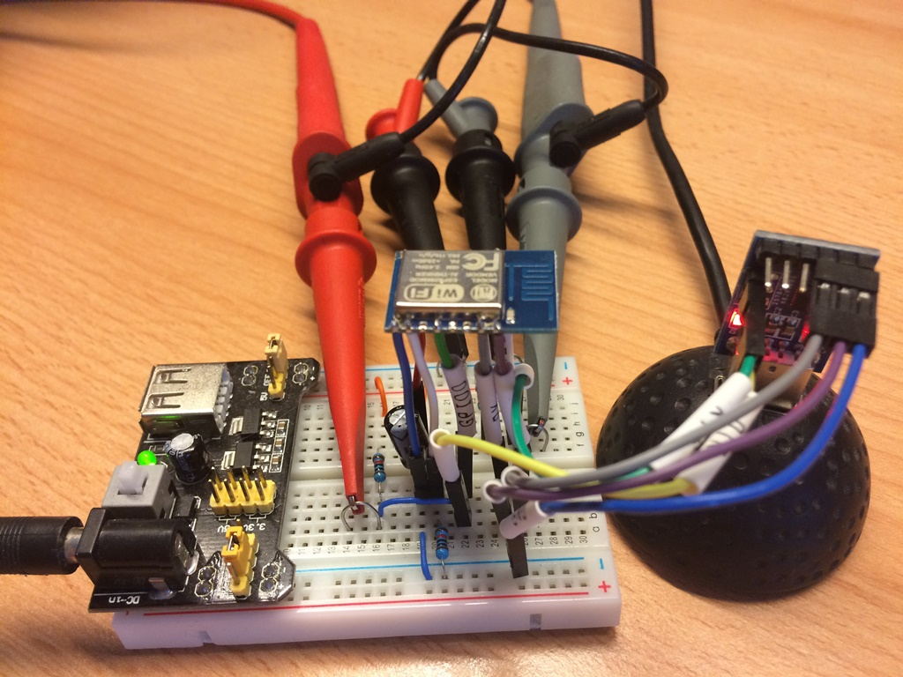

   Test stand used during checking of ck reset method

Test stand used for checking of ck reset method is shown above.

No any ESP module has been harmed during preparation of this FAQ item.

`FAQ list :back: <readme.rst>`__
