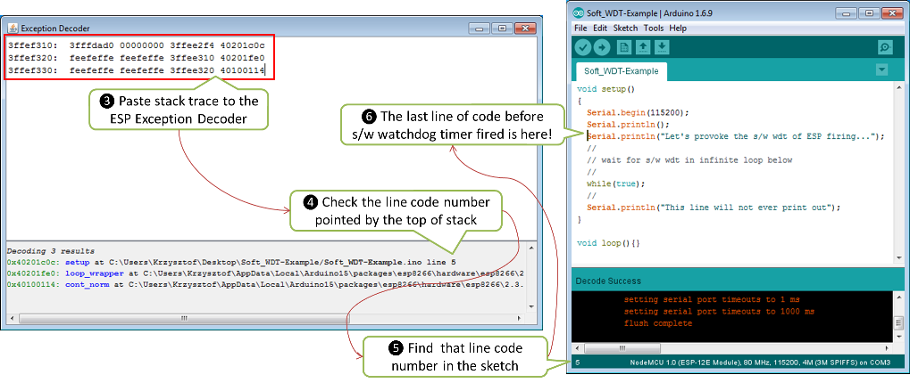

[FAQ list :back:](readme.md)


## My ESP crashes running some code. How to troubleshoot it?


* [Introduction](#introduction)
* [What ESP has to Say](#what-esp-has-to-say)
* [Get Your H/W Right](#get-your-hw-right)
* [What is the Cause of Restart?](#what-is-the-cause-of-restart)
  * [Exception](#exception)
  * [Watchdog](#watchdog)
* [Check Where the Code Crashes](#check-where-the-code-crashes)
* [If at the Wall, Enter an Issue Report](#if-at-the-wall-enter-an-issue-report)
* [Conclusion](#conclusion)


### Introduction

Your ESP is self restarting. You don't know why and what to do about it.

Do not panic. 

In most of cases ESP provides enough clues on serial monitor, that you can interpret to pin down the root cause. The first step is then checking what ESP is saying on serial monitor when it crashes.


### What ESP has to Say

Start off by opening a Serial Monitor (Ctrl+Shift+M) to observe the output. Typical crash log looks as follows:


Before rushing to copy and paste displayed code to Google, reflect for a while on the nature of observed restarts:

* Does ESP restart on random basis, or under certain conditions, like serving a web page?
* Do you see always the same exception code and stack trace or it changes?
* Does this issue occur with unmodified standard example code (Arduino IDE > *File > Examples*)?

If restarts are random or the exception code differs between restarts, then the problem may be caused by h/w. If the issue occurs for standard examples and stable [esp8266 / arduino](https://github.com/esp8266/Arduino) core, them the issue is almost certainly caused by h/w.


### Get Your H/W Right

If you suspect the h/w, before troubleshooting the s/w, make sure to get your h/w right. There is no much sense in diagnosing the s/w if you board is randomly crashing because of not enough power, missing boot strapping resistors or loose connections.

If you are using generic ESP modules, please follow [recommendations](Generic ESP8266 modules) on power supply and boot strapping resistors. 

For boards with integrated USB to serial converter and power supply, usually it is enough to connect it to an USB hub that provides standard 0.5A and is not shared with other USB devices.

In any case make sure that your module is able to stable run standard example sketches that establish Wi-Fi connection like e.g. [HelloServer.ino](https://github.com/esp8266/Arduino/tree/master/libraries/ESP8266WebServer/examples/HelloServer).


### What is the Cause of Restart?

You have verified that the ESP h/w is healthy but it still restarts. This is how ESP reacts to abnormal behavior of application. If something is wrong, it restarts itself to tell you about it. 

There are two typical scenarios that trigger ESP restarts:

* **Exception** - when code is performing [illegal operation](https://github.com/esp8266/Arduino/blob/master/doc/exception_causes.md), like trying to write to non-existent memory location.
* **Watchdog** - if code is [locked up](https://en.wikipedia.org/wiki/Watchdog_timer) staying too long in a loop or processing some task, so vital processes like Wi-Fi communication are not able to run.

Please check below how to recognize [exception](#exception) and [watchdog](#watchdog) scenarios and what to do about it. 


#### Exception

Typical restart because of exception looks like follows:


Start with looking up exception code in the [Exception Causes (EXCCAUSE)](https://github.com/esp8266/Arduino/blob/master/doc/exception_causes.md) table to understand what kind of issue it is. If you have no clues what it's about and where it happens, then use [Arduino ESP8266/ESP32 Exception Stack Trace Decoder](https://github.com/me-no-dev/EspExceptionDecoder) to find out in which line of application it is triggered. Please refer to [Check Where the Code Crashes](#check-where-the-code-crashes) point below for a quick example how to do it.


#### Watchdog

ESP provides two watchdog timers (wdt) that observe application for lock up.

* **Software Watchdog** - provided by [SDK](http://bbs.espressif.com/viewforum.php?f=46), that is part of [esp8266 / arduino](https://github.com/esp8266/Arduino) core loaded to module together with your application.
* **Hardware Watchdog** - build in ESP8266 hardware and acting if software watchdog is disabled for too long, in case it fails, or if it is not provided at all.

Restart by particular type of watchdog is clearly identified by ESP on serial monitor.

An example of application crash triggered by software wdt is shown below.


Restart by the software watchdog is generally easier to troubleshoot since log includes the stack trace. The trace can be then used to find particular line in code where wdt has been triggered. 

Reset by hardware watchdog timer is shown on picture below. 


Hardware wdt is the last resort of ESP to tell you that application is locked up (if s/w wdt timer is disabled or not working). 

Please note that for restarts initialized by h/w wdt, there is no stack trace to help you identify the place in code where the lockup has happened. In such case, to identify the place of lock up, you need to rely on debug messages like ``` Serial.print ``` distributed across the application. Then by observing what was the last debug message printed out before restart, you should be able to narrow down part of code firing the h/w wdt reset. If diagnosed application or library has debug option then switch it on to aid this troubleshooting.


### Check Where the Code Crashes

Decoding of ESP stack trace is now easy and available to everybody thanks to great [Arduino ESP8266/ESP32 Exception Stack Trace Decoder](https://github.com/me-no-dev/EspExceptionDecoder) developed by @me-no-dev. 

Installation for Arduino IDE is quick and easy following the [installation](https://github.com/me-no-dev/EspExceptionDecoder#installation) instructions.

If you don't have any code for troubleshooting, use the example below:

```
void setup()
{
  Serial.begin(115200);
  Serial.println();
  Serial.println("Let's provoke the s/w wdt firing...");
  //
  // wait for s/w wdt in infinite loop below
  //
  while(true);
  //
  Serial.println("This line will not ever print out");
}

void loop(){}
```

Upload this code to your ESP (Ctrl+U) and start Serial Monitor (Ctrl+Shift+M). You should shortly see ESP restarting every couple of seconds and ``` Soft WDT reset ``` message together with stack trace showing up on each restart. Click the Autoscroll check-box on Serial Monitor to stop the messages scrolling up. Select and copy the stack trace, go to the *Tools* and open the *ESP Exception Decoder*. 


Now paste the stack trace to Exception Decoder's window. At the bottom of this window you should see a list of decoded lines of sketch you have just uploaded to your ESP. On the top of the list, like on the top of the stack trace, there is a reference to the last line executed just before the software watchdog timer fired causing the ESP's restart. Check the number of this line and look it up on the sketch. It should be the line ``` Serial.println("Let's provoke the s/w wdt firing...") ```, that happens to be just before ``` while(true) ``` that made the watchdog fired (ignore the lines with comments, that are discarded by compiler).



Armed with [Arduino ESP8266/ESP32 Exception Stack Trace Decoder](https://github.com/me-no-dev/EspExceptionDecoder) you can track down where the module is crashing whenever you see the stack trace dropped. The same procedure applies to crashes caused by exceptions.

> Note: To decode the exact line of code where the application crashed, you need to use ESP Exception Decoder in context of sketch you have just loaded to the module for diagnosis. Decoder is not able to correctly decode the stack trace dropped by some other application not compiled and loaded from your Arduino IDE.


### If at the Wall, Enter an Issue Report

Using the procedure above you should be able to troubleshoot all the code you write. It may happen that ESP is crashing inside some library or code you are not familiar enough to troubleshoot. If this is the case then contact the application author by writing an issue report.

Follow the guidelines on issue reporting that may be provided by the author of code in his / her repository.

If there are no guidelines, include in your report the following:

* [ ] Exact steps by step instructions to reproduce the issue
* [ ] Your exact hardware configuration including the schematic
* [ ] If the issue concerns standard, commercially available ESP board with power supply and USB interface, without extra h/w attached, then provide just the board type or link to description
* [ ] Configuration settings in Arduino IDE used to upload the application
* [ ] Error log & messages produced by the application (enable debugging for more details)
* [ ] Decoded stack trace
* [ ] Copy of your sketch
* [ ] Copy of all the libraries used by the sketch
* [ ] If you are using standard libraries available in Library Manager, then provide just version numbers
* [ ] Version of [esp8266 / Arduino](https://github.com/esp8266/Arduino) core
* [ ] Name and version of your programming IDE and O/S

With plenty of ESP module types available, several versions of libraries or [esp8266 / Arduino](https://github.com/esp8266/Arduino) core, types and versions of O/S, you need to provide exact information what your application is about. Only then people willing to look into your issue may be able to refer it to configuration they have. If you are lucky, they may even attempt to reproduce your issue on their equipment. This will be far more difficult if you are providing only vague details, so somebody would need to ask you to find out what is really happening.

On the other hand if you flood your issue report with hundreds lines of code, you may also have difficulty to find somebody willing to analyze it. Therefore reduce your code to the bare minimum that is still causing the issue. It will help you as well to isolate the issue and pin done the root cause.


### Conclusion

Do not be afraid to troubleshoot ESP exception and watchdog restarts. [Esp8266 / Arduino](https://github.com/esp8266/Arduino) core provides detailed diagnostics that will help you pin down the issue. Before checking the s/w, get your h/w right. Use [ESP Exception Decoder](https://github.com/me-no-dev/EspExceptionDecoder) to find out where the code fails. If you do you homework and still unable to identify the root cause, enter the issue report. Provide enough details. Be specific and isolate the issue. Then ask community for support. There are plenty of people that like to work with ESP and willing to help with your problem.

[FAQ list :back:](readme.md)
