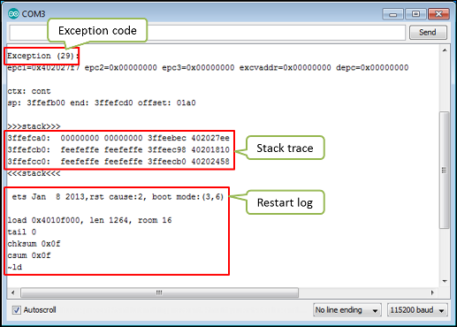
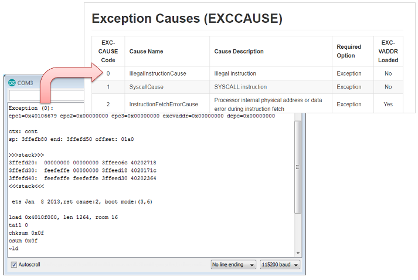
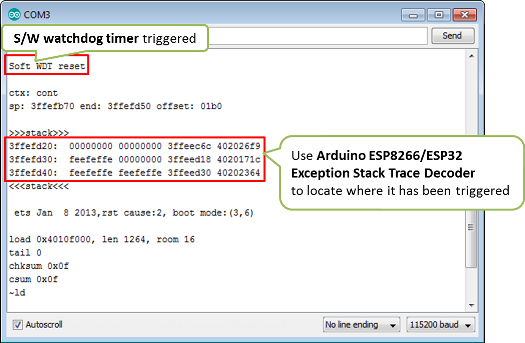
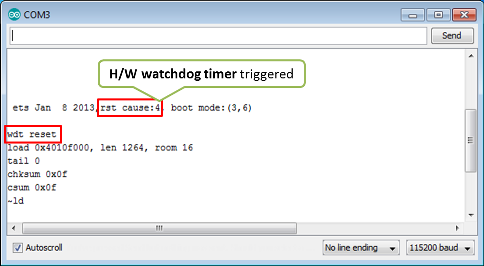
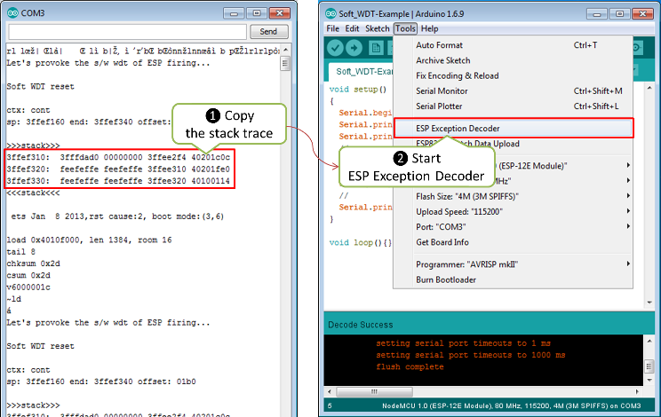

:orphan:

My ESP crashes running some code. How to troubleshoot it?
---------------------------------------------------------

-  `Introduction <#introduction>`__
-  `What ESP has to Say <#what-esp-has-to-say>`__
-  `Get Your H/W Right <#get-your-hw-right>`__
-  `Enable compilation warnings <#enable-compilation-warnings>`__
-  `What is the Cause of Restart? <#what-is-the-cause-of-restart>`__
-  `Exception <#exception>`__
-  `Watchdog <#watchdog>`__
-  `Exception Decoder <#exception-decoder>`__
-  `Other Common Causes for Crashes <#other-causes-for-crashes>`__
-  `If at the Wall, Enter an Issue
   Report <#if-at-the-wall-enter-an-issue-report>`__
-  `Conclusion <#conclusion>`__

Introduction
~~~~~~~~~~~~

Your ESP is self restarting. You don't know why and what to do about it.

Do not panic.

In most of cases ESP provides enough clues on serial monitor, that you
can interpret to pin down the root cause. The first step is then
checking what ESP is saying on serial monitor when it crashes.

What ESP has to Say
~~~~~~~~~~~~~~~~~~~

Start off by opening a Serial Monitor (Ctrl+Shift+M) to observe the
output. Typical crash log looks as follows:

   Typical crash log

Before rushing to copy and paste displayed code to Google, reflect for a
while on the nature of observed restarts:

-  Does ESP restart on random basis, or under certain conditions, like
   serving a web page?
-  Do you see always the same exception code and stack trace or it
   changes?
-  Does this issue occur with unmodified standard example code (Arduino
   IDE > *File > Examples*)?

If restarts are random or the exception code differs between restarts,
then the problem may be caused by h/w. If the issue occurs for standard
examples and stable `esp8266 /
arduino <https://github.com/esp8266/Arduino>`__ core, them the issue is
almost certainly caused by h/w.

Get Your H/W Right
~~~~~~~~~~~~~~~~~~

If you suspect the h/w, before troubleshooting the s/w, make sure to get
your h/w right. There is no much sense in diagnosing the s/w if you
board is randomly crashing because of not enough power, missing boot
strapping resistors or loose connections.

If you are using generic ESP modules, please follow
`recommendations <Generic%20ESP8266%20modules>`__ on power supply and
boot strapping resistors.

For boards with integrated USB-to-serial converter and power supply,
usually it is enough to connect it to an USB hub that provides standard
0.5A and is not shared with other USB devices.

In any case, make sure that your module is able to stably run standard
example sketches that establish Wi-Fi connection like, e.g.,
`HelloServer.ino <https://github.com/esp8266/Arduino/tree/master/libraries/ESP8266WebServer/examples/HelloServer>`__.

Enable compilation warnings
~~~~~~~~~~~~~~~~~~~~~~~~~~~

Most common issues may be resolved by enabling compilation warnings and fixing them.

For Arduino IDE, select ``File -> Preferences``:

- Make sure ``Show verbose output during: compilation`` is enabled
- Set ``Compiler warnings`` to ``More`` or ``All``

For PlatformIO, all warnings should already be enabled by default.

Notice that the default configuration of Arduino IDE inhibits **all** compilation warnings.
For the ESP8266 platform, some warnings should be treated as errors, otherwise it may cause unexpected issues at runtime:

.. code:: cpp

    int func() {
    }

    int other() {
      return func();
    }

Should fail to build with the following message:

.. code:: console

    return-value.cpp: In function ‘int func()’:
    return-value.cpp:2:1: error: no return statement in function returning non-void [-Werror=return-type]
        2 | }
          | ^
    compilation terminated due to -Wfatal-errors.
    cc1plus: some warnings being treated as errors

Notice that ``-Werror=return-type`` is the default starting with Core 3.0.2 w/ GCC 10.3

What is the Cause of Restart?
~~~~~~~~~~~~~~~~~~~~~~~~~~~~~

You have verified that the ESP h/w is healthy but it still restarts.
This is how ESP reacts to abnormal behavior of application. If something
is wrong, it restarts itself to tell you about it.

There are two typical scenarios that trigger ESP restarts:

-  **Exception** - when the code attempts an `illegal
   operation <../exception_causes.rst>`__,
   like trying to write to non-existent memory location.
-  **Watchdog** - if the code `locks
   up <https://en.wikipedia.org/wiki/Watchdog_timer>`__, staying too long
   in a loop or processing any other task without any pauses, which would
   prevent vital processes like Wi-Fi communication from running.

Please check below how to recognize `exception <#exception>`__ and
`watchdog <#watchdog>`__ scenarios and what to do about it.

Exception
^^^^^^^^^

Typical restart because of exception looks like follows:

   Exception cause decoding

Start with looking up exception code in the `Exception Causes
(EXCCAUSE) <../exception_causes.rst>`__
table to understand what kind of issue it is. If you have no clues what
it's about and where it happens, then use `Arduino ESP8266/ESP32
Exception Stack Trace
Decoder <https://github.com/me-no-dev/EspExceptionDecoder>`__ to find
out in which line of application it is triggered. Please refer to `Check
Where the Code Crashes <#check-where-the-code-crashes>`__ point below
for a quick example how to do it.

**NOTE:** When decoding exceptions be sure to include all lines between
the ``---- CUT HERE ----`` marks in the output to allow the decoder to also
provide the line of code that's actually causing the exception.

Watchdog
^^^^^^^^

ESP provides two watchdog timers (wdt) that observe application for lock
up.

-  **Software Watchdog** - provided by
   `SDK <https://bbs.espressif.com/viewforum.php?f=46>`__, that is part
   of `esp8266 / arduino <https://github.com/esp8266/Arduino>`__ core
   loaded to module together with your application.
-  **Hardware Watchdog** - built-in ESP8266 hardware, acting if the
   software watchdog is disabled for too long, in case it fails, or if
   it is not provided at all.

Restart by particular type of watchdog is clearly identified by ESP on
serial monitor.

An example of application crash triggered by software wdt is shown
below.

   Example of restart by s/w watchdog

Restart by the software watchdog is generally easier to troubleshoot
since log includes the stack trace. The trace can be then used to find
particular line in code where wdt has been triggered.

Reset by hardware watchdog timer is shown on picture below.

   Example of restart by h/w watchdog

Hardware wdt is the last resort of ESP to tell you that application is
locked up (if s/w wdt timer is disabled or not working).

Please note that for restarts initialized by h/w wdt, there is no stack
trace to help you identify the place in code where the lockup has
happened. In such case, to identify the place of lock up, you need to
rely on debug messages like ``Serial.print`` distributed across the
application. Then by observing what was the last debug message printed
out before restart, you should be able to narrow down part of code
firing the h/w wdt reset. If diagnosed application or library has debug
option then switch it on to aid this troubleshooting.

Exception Decoder
~~~~~~~~~~~~~~~~~

Decoding of ESP stack trace is now easy and available to everybody
thanks to great `Arduino ESP8266/ESP32 Exception Stack Trace
Decoder <https://github.com/me-no-dev/EspExceptionDecoder>`__ developed
by @me-no-dev.

Installation for Arduino IDE is quick and easy following the
`installation <https://github.com/me-no-dev/EspExceptionDecoder#installation>`__
instructions.

If you don't have any code for troubleshooting, use the example below:

::

    void setup()
    {
      Serial.begin(115200);
      Serial.println();
      Serial.println("Let's provoke the s/w wdt firing...");
      //
      // provoke an OOM, will be recorded as the last occurred one
      char* out_of_memory_failure = (char*)malloc(1000000);
      //
      // wait for s/w wdt in infinite loop below
      while(true);
      //
      Serial.println("This line will not ever print out");
    }

    void loop(){}

Enable the Out-Of-Memory (*OOM*) debug option (in the *Tools > Debug Level*
menu), compile/flash/upload this code to your ESP (Ctrl+U) and start Serial
Monitor (Ctrl+Shift+M).  You should shortly see ESP restarting every couple
of seconds and ``Soft WDT reset`` message together with stack trace showing
up on each restart.  Click the Autoscroll check-box on Serial Monitor to
stop the messages scrolling up.  Select and copy the stack trace, including
the ``last failed alloc call: ...`` line, go to the *Tools* and open the
*ESP Exception Decoder*.

   Decode the stack trace, steps 1 and 2

Now paste the stack trace to Exception Decoder's window. At the bottom
of this window you should see a list of decoded lines of sketch you have
just uploaded to your ESP. On the top of the list, like on the top of
the stack trace, there is a reference to the last line executed just
before the software watchdog timer fired causing the ESP's restart.
Check the number of this line and look it up on the sketch. It should be
the line ``Serial.println("Let's provoke the s/w wdt firing...")``, that
happens to be just before ``while(true)`` that made the watchdog fired
(ignore the lines with comments, that are discarded by compiler).

.. figure:: pictures/a02-decode-stack-tace-3-6.png
   :alt: Decode the stack trace, steps 3 through 6

   Decode the stack trace, steps 3 through 6

Armed with `Arduino ESP8266/ESP32 Exception Stack Trace
Decoder <https://github.com/me-no-dev/EspExceptionDecoder>`__ you can
track down where the module is crashing whenever you see the stack trace
dropped. The same procedure applies to crashes caused by exceptions.

    Note, to decode the exact line of code where the application
    crashed, you need to use ESP Exception Decoder in context of sketch
    you have just loaded to the module for diagnosis. Decoder is not
    able to correctly decode the stack trace dropped by some other
    application not compiled and loaded from your Arduino IDE.

Improving Exception Decoder Results
~~~~~~~~~~~~~~~~~~~~~~~~~~~~~~~~~~~

Due to the limited resources on the device, our default compiler optimizations
focus on creating the smallest code size (``.bin`` file). The GCC compiler's
option ``-Os`` contains the base set of optimizations used. This set is fine for
release but not ideal for debugging.

Our view of a crash is often the `Stack Dump <../Troubleshooting/stack_dump.rst>`__
which gets copy/pasted into an Exception Decoder.
For some situations, the optimizer doesn't write caller return addresses to the
stack. When we crash, the list of functions called is missing. And when the
crash occurs in a leaf function, there is seldom if ever any evidence of who
called.

With the ``-Os`` option, functions called once are inlined into the calling
function. A chain of these functions can optimize down to the calling function.
When the crash occurs in one of these chain functions, the actual location in
the source code is no longer available.

When you select ``Debug Optimization: Lite`` on the Arduino IDE Tools menu, it
turns off ``optimize-sibling-calls``. Turning off this optimization allows more
caller addresses to be written to the stack, improving the results from the
Exception Decoder. Without this option, the callers involved in the crash may be
missing from the Decoder results. Because of the limited stack space, there is
the remote possibility that removing this optimization could lead to more
frequent stack overflows. You only want to do this in a debug setting. This
option does not help the chained function issue.

When you select ``Debug Optimization: Optimum``, you get an even more complete
stack trace. For example, chained function calls may show up. This selection
uses the compiler option ``-Og``. GCC considers this the ideal optimization for
the "edit-compile-debug cycle" ... "producing debuggable code." You can read the
specifics at `GCC's Optimize Options <https://gcc.gnu.org/onlinedocs/gcc/Optimize-Options.html>`__

When global optimization creates build size issues or stack overflow issues,
select ``Debug Optimization: None``, and use a targeted approach with
``#pragma GCC optimize("Og")`` at the module level. Or, if you want to use a
different set of optimizations, you can set optimizations through build options.
Read more at `Global Build Options <a06-global-build-options.rst>`__.

For non-Arduino IDE build platforms, you may need to research how to add build
options. Some build platforms already use ``-Og`` for debug builds.

A crash in a leaf function may not leave the caller's address on the stack.
The return address can stay in a register for the duration of the call.
Resulting in a crash report identifying the crashing function without a
trace of who called. You can encourage the compiler to save the caller's
return address by adding an inline assembly trick
``__asm__ __volatile__("" ::: "a0", "memory");`` at the beginning of the
function's body. Or instead, for a debug build conditional option, use the
macro ``DEBUG_LEAF_FUNCTION()`` from ``#include <debug.h>``. The ``-Og`` option
will address the leaf function issue in a later compiler update.

Other Causes for Crashes
~~~~~~~~~~~~~~~~~~~~~~~~

Interrupt Service Routines
   By default, all functions are compiled into flash, which means that the
   cache may kick in for that code. However, the cache currently can't be used
   during hardware interrupts. That means that, if you use a hardware ISR, such as
   attachInterrupt(gpio, myISR, CHANGE) for a GPIO change, the ISR must have the
   IRAM_ATTR attribute declared. Not only that, but the entire function tree
   called from the ISR must also have the IRAM_ATTR declared.
   Be aware that every function that has this attribute reduces available memory.

   In addition, it is not possible to execute delay() or yield() from an ISR,
   or do blocking operations, or operations that disable the interrupts, e.g.: read
   a DHT.

   Finally, an ISR has very high restrictions on timing for the executed code, meaning
   that executed code should not take longer than a very few microseconds. It is
   considered best practice to set a flag within the ISR, and then from within the loop()
   check and clear that flag, and execute code.

Asynchronous Callbacks
   Asynchronous CBs, such as for the Ticker or ESPAsync* libs, have looser restrictions
   than ISRs, but some restrictions still apply.
   It is not possible to execute delay() or yield() from an asynchronous callback.
   Timing is not as tight as an ISR, but it should remain below a few milliseconds. This
   is a guideline. The hard timing requirements depend on the WiFi configuration and
   amount of traffic. In general, the CPU must not be hogged by the user code, as the
   longer it is away from servicing the WiFi stack, the more likely that memory corruption
   can happen.

Memory, memory, memory
   Running out of heap is the **most common cause for crashes**. Because the build process for
   the ESP leaves out exceptions (they use memory), memory allocations that fail will do
   so silently. A typical example is when setting or concatenating a large String. If
   allocation has failed internally, then the internal string copy can corrupt data, and
   the ESP will crash.

   In addition, doing many String concatenations in sequence, e.g.: using operator+()
   multiple times, will cause memory fragmentation. When that happens, allocations may
   silently fail even though there is enough total heap available. The reason for the
   failure is that an allocation requires finding a single free memory block that is large
   enough for the size being requested. A sequence of String concatenations causes many
   allocations/deallocations/reallocations, which makes "holes" in the memory map. After
   many such operations, it can happen that all available holes are too small to comply
   with the requested size, even though the sum of all holes is greater than the requested
   size.

   So why do these silent failures exist? On the one hand, there are specific interfaces that
   must be adhered to. For example, the String object methods don't allow for error handling
   at the user application level (i.e.: no old-school error returns).
   On the other hand, some libraries don't have the allocation code accessible for
   modification. For example, std::vector is available for use. The standard implementations
   rely on exceptions for error handling, which is not available for the ESP, and in any
   case there is no access to the underlying code.

   Instrumenting the code with the OOM debug option and calls to
   ``ESP.getFreeHeap()`` / ``ESP.getHeapFragmentation()`` /
   ``ESP.getMaxFreeBlockSize()`` will help the process of finding memory issues.

   Now is time to re-read about the `exception decoder
   <#exception-decoder>`__.

*Some techniques for reducing memory usage*

   * Don't use const char * with literals. Instead, use const char[] PROGMEM. This is particularly true if you intend to, e.g.: embed html strings.
   * Don't use global static arrays, such as uint8_t buffer[1024]. Instead, allocate dynamically. This forces you to think about the size of the array, and its scope (lifetime), so that it gets released when it's no longer needed. If you are not certain about dynamic allocation, use std libs (e.g.: std:vector, std::string), or smart pointers. They are slightly less memory efficient than dynamically allocating yourself, but the provided memory safety is well worth it.
   * If you use std libs like std::vector, make sure to call its ::reserve() method before filling it. This allows allocating only once, which reduces mem fragmentation, and makes sure that there are no empty unused slots left over in the container at the end.

Stack
   The amount of stack in the ESP is tiny at only 4KB. For normal development in large systems, it
   is good practice to use and abuse the stack, because it is faster for allocation/deallocation, the scope of the object is well defined, and deallocation automatically happens in reverse order as allocation, which means no mem fragmentation. However, with the tiny amount of stack available in the ESP, that practice is not really viable, at least not for big objects.

   * Large objects that have internally managed memory, such as String, std::string, std::vector, etc, are ok on the stack, because they internally allocate their buffers on the heap.
   * Large arrays on the stack, such as uint8_t buffer[2048] should be avoided on the stack and should be dynamically allocated instead (consider smart pointers).
   * Objects that have large data members, such as large arrays, should also be avoided on the stack, and should be dynamically allocated (consider smart pointers).

If at the Wall, Enter an Issue Report
~~~~~~~~~~~~~~~~~~~~~~~~~~~~~~~~~~~~~

Using the procedure above you should be able to troubleshoot all the
code you write. It may happen that ESP is crashing inside some library
or code you are not familiar enough to troubleshoot. If this is the case
then contact the application author by writing an issue report.

Follow the guidelines on issue reporting that may be provided by the
author of code in his / her repository.

If there are no guidelines, include in your report the following:

-  [ ] Exact step-by-step instructions to reproduce the issue
-  [ ] Your exact hardware configuration including the schematic
-  [ ] If the issue concerns a standard, commercially available ESP board
   with power supply and USB interface, without extra h/w attached, then
   provide just the board type or a link to its description
-  [ ] Configuration settings in Arduino IDE used to upload the
   application
-  [ ] Error log & messages produced by the application (enable
   debugging for more details)
-  [ ] Decoded stack trace
-  [ ] Copy of your sketch
-  [ ] Copy of all the libraries used by the sketch (if you are using
   standard libraries available in the Arduino Library Manager,
   then provide just version numbers)
-  [ ] Version of `esp8266 /
   Arduino <https://github.com/esp8266/Arduino>`__ core
-  [ ] Name and version of your programming IDE and O/S

With plenty of ESP module types available, several versions of libraries
or `esp8266 / Arduino <https://github.com/esp8266/Arduino>`__ core,
types and versions of O/S, you need to provide exact information on what
your application is about. Only then, people willing to look into your
issue may be able to compare it to a configuration they are familiar with.
If you are lucky, they may even attempt to reproduce your issue on their
own equipment!
This will be far more difficult if you provide only vague details,
so somebody would need to ask you to find out what is really happening.

On the other hand, if you flood your issue report with hundreds lines of
code, you may also have difficulty finding somebody willing to analyze
it. Therefore, reduce your code to the bare minimum that is still causing
the issue. This will also help to isolate the issue and pin down
the root cause.

Conclusion
~~~~~~~~~~

Do not be afraid to troubleshoot ESP exception and watchdog restarts.
`Esp8266 / Arduino <https://github.com/esp8266/Arduino>`__ core provides
detailed diagnostics that will help you pin down the issue. Before
checking the s/w, get your h/w right. Use `ESP Exception
Decoder <https://github.com/me-no-dev/EspExceptionDecoder>`__ to find
out where the code fails. If you do you homework and are still unable to
identify the root cause, submit an issue report. Provide enough details.
Be specific and isolate the issue. Then ask community for support. There
are plenty of people that like to work with ESP and willing to help with
your problem.

`FAQ list :back: <readme.rst>`__
