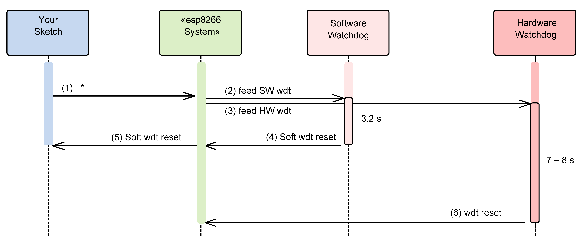

The purpose of this FAQ / Troubleshooting is to respond to questions commonly asked in [Issues](https://github.com/esp8266/Arduino/issues) section and on [ESP8266 Community forum](http://www.esp8266.com/). 

Where possible we are going right to the answer and provide it within one or two paragraphs. If it takes more than that, you will see a link :arrow_right: to more details.

Please feel free to contribute if you believe that some frequent issues are not covered below.


### I am getting "espcomm_sync failed" error when trying to upload my ESP. How to resolve this issue?

This message indicates issue with uploading ESP module over a serial connection. There are couple of possible causes, that depend on the type of your module, if you use separate USB to serial converter [:arrow_right:](a01-espcomm_sync-failed.md)

### Why esptool is not listed in "Programmer" menu? How do I upload ESP without it?

Do not worry about "Programmer" menu of Arduino IDE. It doesn't matter what is selected in it — upload now always defaults to using esptool. 

Ref. [#138](https://github.com/esp8266/Arduino/issues/138), [#653](https://github.com/esp8266/Arduino/issues/653) and [#739](https://github.com/esp8266/Arduino/issues/739).


### My ESP crashes running some code. How to troubleshoot it?

The code may crash because of s/w bug or issue with your h/w. Before entering an issue report, please perform initial troubleshooting [:arrow_right:](a02-my-esp-crashes.md)


### This Arduino library doesn't work on ESP. How do I make it working?

You would like to use this Arduino library with ESP8266 and it does not perform.  It is not listed among libraries verified to work with ESP8266 [:arrow_right:](a03-library-does-not-work.md)


### In the IDE, for ESP-12E that has 4M flash, I can choose 4M (1M SPIFFS) or 4M (3M SPIFFS). No matter what I select, the IDE tells me the maximum code space is about 1M. Where does my flash go? 

The reason we cannot have more than 1MB of code in flash has to do with a hardware limitation. Flash cache hardware on the ESP8266 only allows mapping 1MB of code into the CPU address space at any given time. You can switch mapping offset, so technically you can have more than 1MB total, but switching such "banks" on the fly is not easy and efficient, so we don't bother doing that. Besides, no one has so far complained about 1MB of code space being insufficient for practical purposes.

The option to choose 4M or 1M SPIFFS is to optimize the upload time. Uploading 3MB takes a long time so sometimes you can just use 1MB. Other 2MB of flash can still be used with ``` ESP.flashRead ``` and ``` ESP.flashWrite ``` APIs if necessary.


### I have observed a case when ESP.restart() doesn't work. What is the reason for that? 

You will see this issue only if serial upload was not followed by a physical reset (e.g. power-on reset). For a device being in that state ESP.restart() will not work. Apparently the issue is caused by [one of internal registers not being properly updated until physical reset](https://github.com/esp8266/Arduino/issues/1017#issuecomment-200605576). This issue concerns only serial uploads. OTA uploads are not affected. If you are using ESP.restart(), the work around is to reset ESP once after each serial upload.

Ref. [#1017](https://github.com/esp8266/Arduino/issues/1017), [#1107](https://github.com/esp8266/Arduino/issues/1107), [#1782](https://github.com/esp8266/Arduino/issues/1782)


### I'm getting these Watchdog Resets "wdt reset"—How can I avoid them?
The esp8266 is equipped with two watchdog timers: A software watchdog and a hardware watchdog. If you don't understand why microcontrollers need a watchdog (timer), you may first read [here](http://www.embedded.com/electronics-blogs/beginner-s-corner/4023849/Introduction-to-Watchdog-Timers).

When your sketch is running—either in the `setup` or during the `loop`—you have to make sure to feed the watchdog periodically. Otherwise "it will bite" and the watchdog reset will stop your sketch. The basic operation is illustrated in the following picture:


**How does the esp8266 Arduino Core feed the watchdog(s)? **
From the perspective of your Arduino sketch, the basic feeding is implicit: Everytime an iteration of your main loop starts again, i.e. it hits the `loop` statement, (1) takes place and both watchdogs are fed. Esp8266 Arduino libraries, especially core libraries like for instance the `ESP8266WiFi` library take care of feeding the watchdogs, too. Thus, normally you don't have to feed them explicitly.

**When and why should I feed the watchdog(s) explicitly?**
The software watchdog bites exactly every 3.2 seconds, the hardware watchdog every 7–8 seconds. If your sketch contains code which could exceed running for 3.2 seconds you must feed the watchdogs. I.e. you have to feed them explicitly by calling

 - `yield()`
 or
 - `delay(...)`

Note that calling `delayMicroseconds(...)` does **not** feed the watchdogs!

**Can I disable the watchdogs?**
You can disable the software watchdog but you **cannot** disable the hardware watchdog. Furthermore, you **cannot** change the intervals of the watchdogs timers. 

The following code snippet shows you how to disable the software watchdog and how to feed the hardware watchdog periodically.
```c
extern "C" {
    #include "user_interface.h"
}
int j = 0;
unsigned long a, b;

void setup() {
  delay(1000); // This feeds both watchdogs
  Serial.begin(115200);
  Serial.println("Setup...");
}
// This function keeps the cpu busy for 1 second by doing stupid NOPs
void ICACHE_RAM_ATTR busy_1second() {
    unsigned int i, iterations;
  if (F_CPU == 160000000) {
        iterations = 13333332;
  }
  else {
        iterations = 6666666;
  }
  
  for (i = 0; i < iterations; i++) {
    asm(
      "NOP;"
      "NOP;"
      "NOP;"
      "NOP;"
      "NOP;"
      "NOP;"
      "NOP;"
    );
  }
}
void loop() {
  Serial.println("Getting busy in 3 seconds...");
  delay(3000);
  Serial.println("now!");
  system_soft_wdt_stop(); // Disable Software watchdog
  system_soft_wdt_feed(); // Feed Hardware Watchdog
  for (j = 1; j < 20; j++) {
    a = micros();
    busy_1second();
    b = micros();
    Serial.println(b - a);
    // Feed Hardware Watchdog every 6 seconds
    if (j % 6 == 0) {
      system_soft_wdt_feed();
      Serial.println("HW Dog fed! Miam miam :-o ");
    }
  }
  system_soft_wdt_feed();
  system_soft_wdt_restart();
}
```
And it will give you the following output:
```
Getting busy in 3 seconds...
now!
1000002
1000007
1000001
1000000
1000000
1000000
HW Dog fed! Miam miam :-o 
1000001
1000007
1000000
1000001
1000001
1000000
HW Dog fed! Miam miam :-o 
1000000
...
```