## Table of Contents
  * [Introduction](#introduction)
    * [Security](#security)
    * [Safety](#safety)
    * [Basic Requirements](#basic-requirements)
  * [Arduino IDE](#arduino-ide)
    * [Requirements](#requirements)
    * [Application Example](#application-example)
      * [Classic OTA](#classic-ota)
      * [ArduinoOTA](#arduinoota)
      * [Troubleshooting](#troubleshooting)
  * [Web Browser](#web-browser)
    * [Requirements](#requirements-1)
    * [Implementation Overview](#implementation-overview)
    * [Application Example](#application-example-1)
  * [HTTP Server](#http-server)
      * [Requirements](#requirements-2)
      * [Arduino code](#arduino-code)
        * [Simple updater](#simple-updater)
        * [Advanced updater](#advanced-updater)
      * [Server request handling](#server-request-handling)
        * [Simple updater](#simple-updater-1)
        * [Advanced updater](#advanced-updater-1)
  * [Stream Interface](#stream-interface)
  * [Updater class](#updater-class)


## Introduction

OTA (Over the Air) update is the process of loading the firmware to ESP module using Wi-Fi connection rather that a serial port. Such functionality became extremely useful in case of limited or no physical access to the module.

OTA may be done using:

* [Arduino IDE](#arduino-ide)
* [Web Browser](#web-browser)
* [HTTP Server](#http-server)

Arduino IDE option is intended primarily for software development phase. The two other options would be more useful after deployment, to provide module with application updates manually with a web browser or automatically using a http server.

In any case first firmware upload have to be done over a serial port. If OTA routines are correctly implemented in a sketch, then all subsequent uploads may be done over the air.

There is no imposed security on OTA process from being hacked. It is up to developer to ensure that updates are allowed only from legitimate / trusted source. Once update is complete, module restarts and new code is executed. Developer should ensure that application running on module is shut down and restarted in a safe manner. Chapters below provide additional information regarding security and safety of OTA process.


### Security

Module has to be exposed wirelessly to get it updated with a new sketch. That poses chances of module being violently hacked and loaded with some other code. To reduce likelihood of being hacked consider protecting your uploads with a password, selecting certain OTA port, etc.

Check functionality provided with [ArduinoOTA](https://github.com/esp8266/Arduino/tree/master/libraries/ArduinoOTA) library that may improve security:

```cpp
void setPort(uint16_t port);
void setHostname(const char* hostname);
void setPassword(const char* password);
```

Certain protection functionality is already built in and do not require any additional coding by developer. [ArduinoOTA](https://github.com/esp8266/Arduino/tree/master/libraries/ArduinoOTA) and espota.py use [Digest-MD5](https://en.wikipedia.org/wiki/Digest_access_authentication) to authenticate upload. Integrity of transferred data is verified on ESP side using [MD5](https://en.wikipedia.org/wiki/MD5) checksum.

Make your own risk analysis and depending on application decide what library functions to implement. If required consider implementation of other means of protection from being hacked, e.g. exposing module for uploads only according to specific schedule, trigger OTA only be user pressing dedicated “Update” button, etc.


### Safety

OTA process takes ESP’s resources and bandwidth during upload. Then module is restarted and a new sketch executed. Analyse and test how it affects functionality of your existing and new sketch.

If ESP is placed in remote location and controlling some equipment, you should put additional attention what happens if operation of this equipment is suddenly interrupted by update process. Therefore decide how to put this equipment into safe state before starting the update.  For instance your module may be controlling a garden watering system in a sequence. If this sequence is not properly shut down and a water valve left open, your garden may be flooded if this valve is not closed after OTA is finished and module restarts.  

The following functions are provided with [ArduinoOTA](https://github.com/esp8266/Arduino/tree/master/libraries/ArduinoOTA) library and intended to handle functionality of your application during specific stages of OTA or on an OTA error:

```cpp
void onStart(OTA_CALLBACK(fn));
void onEnd(OTA_CALLBACK(fn));
void onProgress(OTA_CALLBACK_PROGRESS(fn));
void onError(OTA_CALLBACK_ERROR (fn));
```

### Basic Requirements

Flash chip size needs a size that is able to hold the old sketch (currently running) and the new sketch (OTA) at the same time.
Keep in mind that the File system and EEPROM for example needs space too (one time) see [flash layout](../filesystem.md#flash-layout).
```cpp
ESP.getFreeSketchSpace();
```
can be used for checking the free space for the new sketch.

For overview of memory layout, where new sketch is stored and how it is copied during OTA process see [Update process - memory view](#update-process---memory-view).


The following chapters provide more details and specific methods of doing OTA.


## Arduino IDE

Uploading modules wirelessly from Arduino IDE is intended for the following typical scenarios:
- during firmware development as a quicker alternative to loading over a serial
- for updating small quantity of modules
- only if modules are available on the same network as the computer with Arduino IDE


### Requirements
 - The ESP and the computer must be connected to the same network.


### Application Example

Currently there are two software configurations that support OTA updates.

- [Classic OTA](#classic-ota-configuration): Arduino IDE 1.6.5 and 1.6.5-947-g39819f0 (of July 23, 2015) version of ESP8266 board support platform package that provides first OTA implementation, yet without support for [ArduinoOTA](https://github.com/esp8266/Arduino/tree/master/libraries/ArduinoOTA) library. This particular configuration soon will be depreciated in favor of new implementation described below.

- [ArduinoOTA](#arduinoota-configuration): Arduino IDE 1.6.7 and 2.0.0 version of platform package. Arduino IDE 1.6.7 is the first release that provides support for [ArduinoOTA](https://github.com/esp8266/Arduino/tree/master/libraries/ArduinoOTA) library.

For information how to install ESP8266 board support in Arduino IDE please refer to https://github.com/esp8266/Arduino#installing-with-boards-manager. Once installed, it is possible to switch between available versions of platform package using Boards Manager:

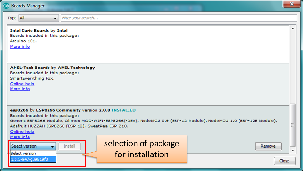

Instructions below demonstrate how to configure both [Classic OTA](#classic-ota-configuration) and [ArduinoOTA](#arduinoota-configuration) using NodeMCU 1.0 (ESP-12E Module) board. You can use other boards assuming that they meet [requirements](#basic-requirements) described above.


#### Classic OTA

1. Before you begin, please make sure that you have the following installed:
    - Arduino IDE 1.6.5 and 1.6.5-947-g39819f0 version of platform package,
    - [Python](https://www.python.org/) 2.7 (do not install Python 3.5 that is not supported).

2. Now prepare the sketch and configuration for the upload over a serial port.
    - Start Arduino IDE and load sketch DNS_SD_Arduino_OTA.ino available under File >  Examples > ESP8266mDNS
        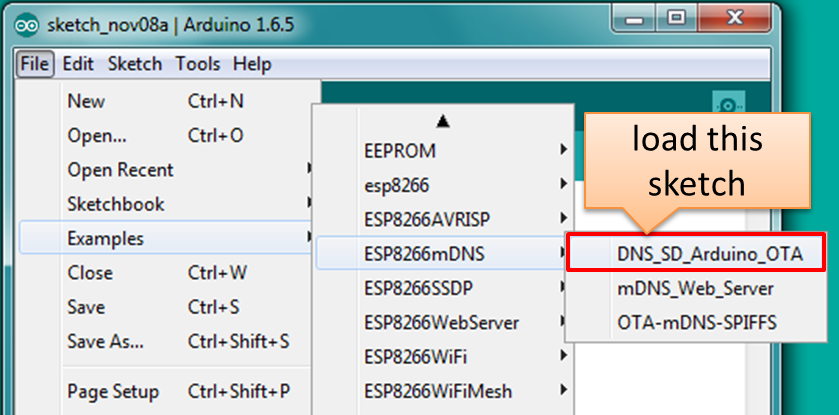

         **Note:** This sketch is available only for 1.6.5-947-g39819f0 (of July 23, 2015) platform package. It was removed in [#980](https://github.com/esp8266/Arduino/pull/980) from GitHub repository.
    - Update SSID and password in the sketch so the module can join your Wi-Fi network
        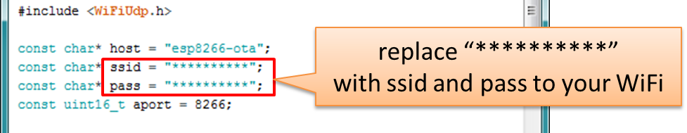
        
    - Configure upload parameters as below (you may need to adjust configuration if you are using a different module):
        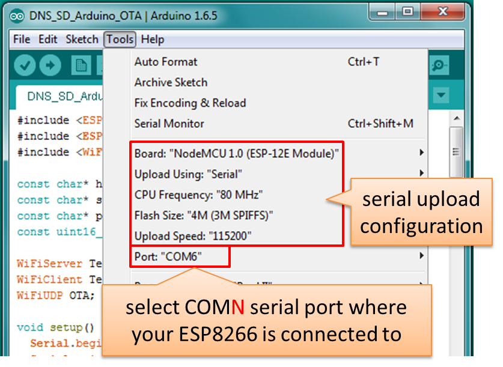

3. Upload the sketch (Ctrl+U). Once done, open Serial Monitor (Ctrl+Shift+M) and check if module has joined your Wi-Fi network.

    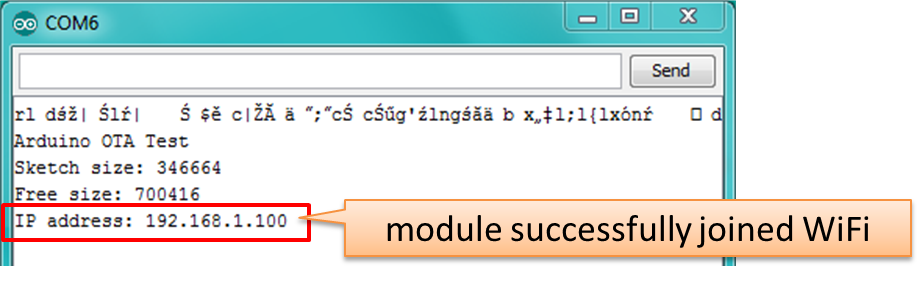

4. Only if module is connected to network, after a couple of seconds, the esp8266-ota port will show up in Arduino IDE:

    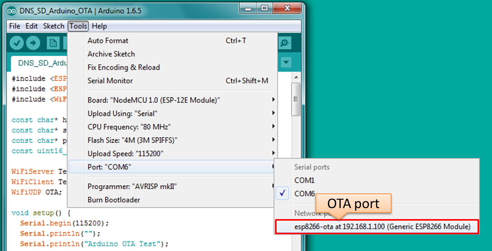

5. Now get ready for your first OTA upload by changing configuration settings as follows:

    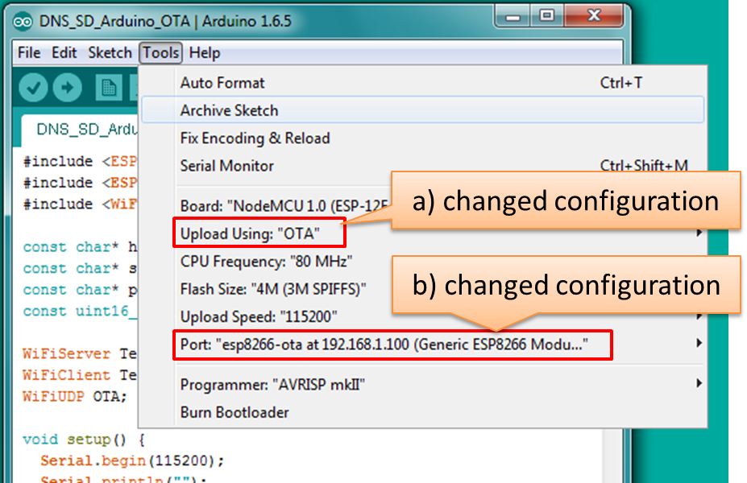

    **Note:** If you do not see “Upload Using: OTA” option available for “NodeMCU 1.0 (ESP-12E Module)” board, please upload the latest [boards.txt](https://github.com/esp8266/Arduino/blob/master/boards.txt) file from GitHub repository, replace existing file and restart Arduino IDE.

6. If you have successfully completed all the above steps, you can upload (Ctrl+U) the same (or any other) sketch over OTA:

    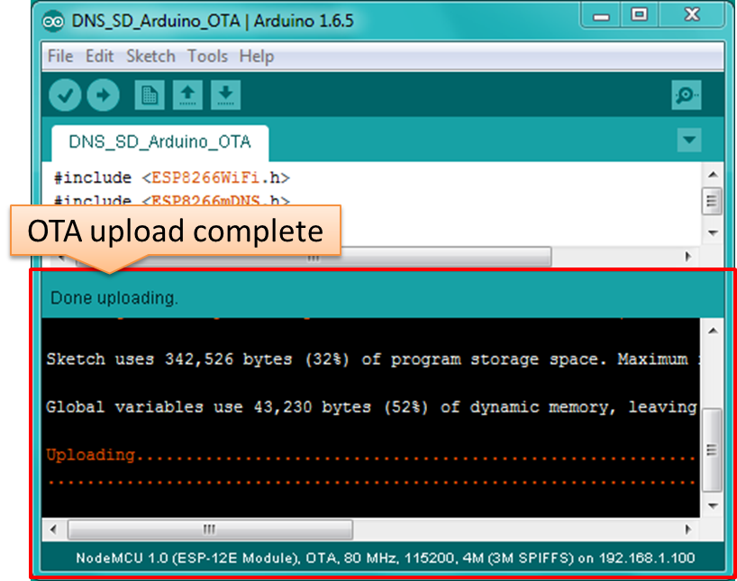

**Note:** To be able to upload your sketch over and over again using OTA, you need to embed OTA routines inside. Please use DNS_SD_Arduino_OTA.ino as an example.

In case of issues please refer to information provided in section [Troubleshooting](#troubleshooting). Successful OTA process looks like below on serial terminal:

```
Arduino OTA Test
Sketch size: 346664
Free size: 700416
IP address: 192.168.1.100
Update Start: ip:192.168.1.10, port:48266, size:346672
Update Success: 6113
Rebooting...

 ets Jan  8 2013,rst cause:1, boot mode:(3,7)

load 0x4010f000, len 1264, room 16 
tail 0
chksum 0x42
csum 0x42
@cp:0
ld

Arduino OTA Test
Sketch size: 346664
Free size: 700416
IP address: 192.168.1.100
```
**Note:** Sketch and free memory sizes as well as IP addresses depend on your particular s/w and h/w configuration.


#### ArduinoOTA

1. Before you begin, please make sure that you have the following installed:
    - Arduino IDE 1.6.7 and 2.0.0 version of platform package following the process described under https://github.com/esp8266/Arduino#installing-with-boards-manager
    - [Python](https://www.python.org/) 2.7 (do not install Python 3.5 that is not supported):

        **Note:** Windows users should select “Add python.exe to Path” (see below – this option is not selected by default).

        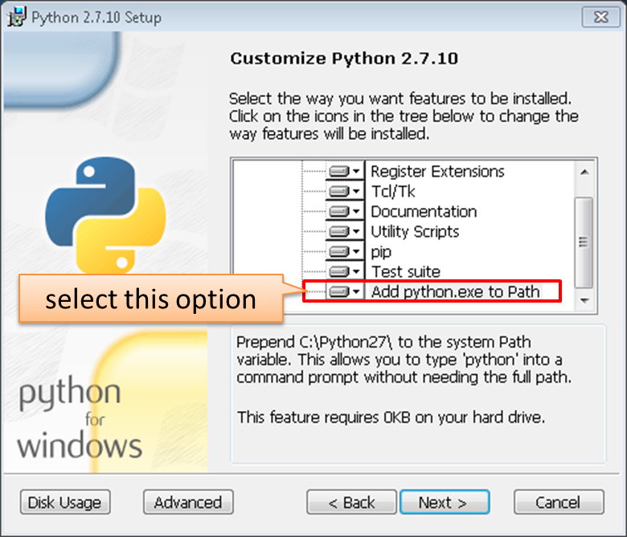

2. Now prepare the sketch and configuration for the upload over a serial port.
    - Start Arduino IDE and load sketch BasicOTA.ino available under File >  Examples > ArduinoOTA
        

    - Update SSID and password in the sketch so the module can join your Wi-Fi network
        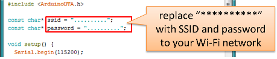
        
    - Configure upload parameters as below (you may need to adjust configuration if you are using a different module):
        

3. Upload the sketch (Ctrl+U). Once done, open Serial Monitor (Ctrl+Shift+M) and check if module has joined your Wi-Fi network:

    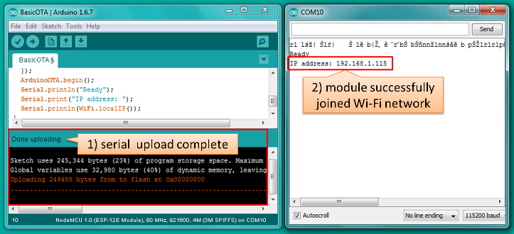

4. Only if module is connected to network, after a couple of seconds, the esp8266-ota port will show up in Arduino IDE:

    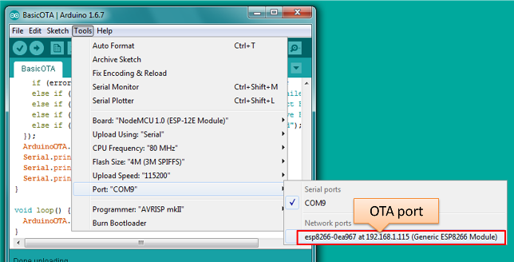
    
    **Note:** If OTA port does not show up, try to exit Arduino IDE, open it again and check if port is there.

5. Now get ready for your first OTA upload by selecting the OTA port:

    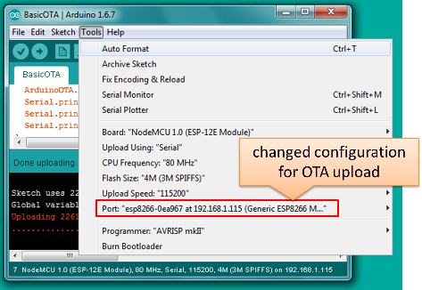
    
    There is no need to change ``` Upload Using: ``` or ``` Upload Speed: ```.

6. If you have successfully completed all the above steps, you can upload (Ctrl+U) the same (or any other) sketch over OTA:

    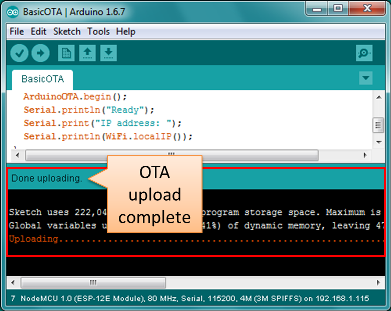

**Note:** To be able to upload your sketch over and over again using OTA, you need to embed OTA routines inside. Please use BasicOTA.ino as an example.


#### Troubleshooting

If OTA update fails, first step is to check for error messages that may be shown in upload window of Arduino IDE. If this is not providing any useful hints try to upload again while checking what is shown by ESP on serial port. Serial Monitor from IDE will not be useful in that case. When attempting to open it, you will likely see the following:


   
This window is for Arduino Yún and not yet implemented for esp8266/Arduino. It shows up because IDE is attempting to open Serial Monitor using network port you have selected for OTA upload.

Instead you need an external serial monitor. If you are a Windows user check out [Termite](http://www.compuphase.com/software_termite.htm). This is handy, slick and simple RS232 terminal that does not impose RTS or DTR flow control. Such flow control may cause issues if you are using respective lines to toggle GPIO0 and RESET pins on ESP for upload. 

Select COM port and baud rate on external terminal program as if you were using Arduino Serial Monitor. Please see typical settings for [Termite](http://www.compuphase.com/software_termite.htm) below:


Then run OTA from IDE and look what is displayed on terminal. Successful [ArduinoOTA](#arduinoota) process using BasicOTA.ino sketch looks like below (IP address depends on your network configuration):

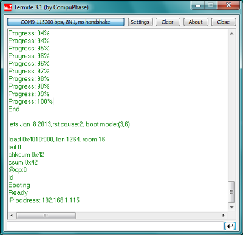

If upload fails you will likely see errors caught by the uploader, exception and the stack dump, or both. 

The most common causes of OTA failure are as follows:
* not enough physical memory on the chip (e.g. ESP01 with 512K flash memory is not enough for OTA),
* too much memory declared for SPIFFS so new sketch will not fit between existing sketch and SPIFFS – see  [Update process - memory view]( https://github.com/esp8266/Arduino/blob/master/doc/ota_updates/ota_updates.md#update-process---memory-view),
* too little memory declared in Arduino IDE for your selected board (i.e. less than physical size). 

For more details regarding flash memory layout please check [File system]( https://github.com/esp8266/Arduino/blob/master/doc/filesystem.md).
For overview where new sketch is stored, how it is copied and how memory is organized for the purpose of OTA see [Update process - memory view]( https://github.com/esp8266/Arduino/blob/master/doc/ota_updates/ota_updates.md#update-process---memory-view).


## Web Browser

Updates described in this chapter are done with a web browser that can be useful in the following typical scenarios:

- after application deployment if loading directly from Arduino IDE is inconvenient or not possible
- after deployment if user is unable to expose module for OTA from external update server
- to provide updates after deployment to small quantity of modules when setting an update server is not practicable


### Requirements

- The ESP and the computer must be connected to the same network.


### Implementation Overview

Updates with a web browser are implemented using ``` ESP8266HTTPUpdateServer ``` class together with ``` ESP8266WebServer ``` and ``` ESP8266mDNS ``` classes. The following code is required to get it work:

setup()

```cpp
	MDNS.begin(host);

	httpUpdater.setup(&httpServer);
	httpServer.begin();

	MDNS.addService("http", "tcp", 80);
```

loop()

```cpp
	httpServer.handleClient();
```


### Application Example

The sample implementation provided below has been done using:

- example sketch WebUpdater.ino available in ``` ESP8266HTTPUpdateServer ``` library
- NodeMCU 1.0 (ESP-12E Module)

You can use another module if it meets previously desribed [requirements](#basic-requirements).


1. Before you begin, please make sure that you have the following software installed:
    - Arduino IDE and 2.0.0-rc1 (of Nov 17, 2015) version of platform package as described under https://github.com/esp8266/Arduino#installing-with-boards-manager
    - Host software depending on O/S you use:
        1. Avahi http://avahi.org/ for Linux
        2. Bonjour http://www.apple.com/support/bonjour/ for Windows
        3. Mac OSX and iOS - support is already built in / no any extra s/w is required

2. Prepare the sketch and configuration for initial upload with a serial port.
    - Start Arduino IDE and load sketch WebUpdater.ino available under File > Examples > ESP8266HTTPUpdateServer.
    - Update SSID and password in the sketch so the module can join your Wi-Fi network.
    - Open File > Preferences, look for “Show verbose output during:” and check out “compilation” option.

        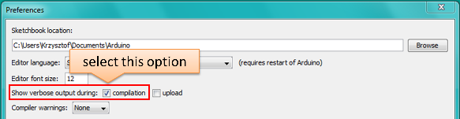

        **Note:** This setting will be required in step 5 below. You can uncheck this setting afterwards.

3. Upload sketch (Ctrl+U). Once done open Serial Monitor (Ctrl+Shift+M) and check if you see the following message displayed, that contains url for OTA update.

    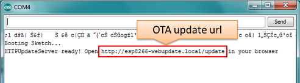

    **Note:** Such message will be shown only after module successfully joins network and is ready for an OTA upload.

4. Now open web browser and enter the url provided on Serial Monitor, i.e. http://esp8266-webupdate.local/update. Once entered, browser should display a form like below that has been served by your module. The form invites you to choose a file for update.

    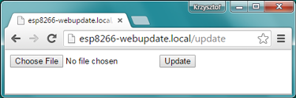
    
    **Note:** If entering ``` http://esp8266-webupdate.local/update ``` does not work, try replacing ``` esp8266-webupdate ``` with module’s IP address. For example, if your module IP is ``` 192.168.1.100 ``` then url should be ``` http://192.168.1.100/update ```. This workaround is useful in case the host software installed in step 2 does not work. If still nothing works and there are no clues on Serial Monitor, try to diagnose issue by opening provided url in Google Chrome, pressing F12 and checking contents of “Console” and “Network” tabs. Chrome provides some advanced logging on these tabs.

5. To obtain the file navigate to directory used by Arduino IDE to store results of compilation. You can check the path to this file in compilation log shown in IDE debug window as marked below.

    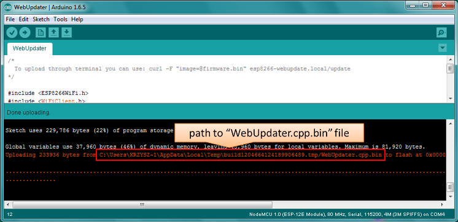

6. Now press “Choose File” in web browser, go to directory identified in step 5 above, find the file “WebUpdater.cpp.bin” and upload it. If upload is successful you will see “OK” on web browser like below.

    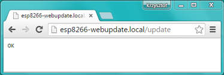

    Module will reboot that should be visible on Serial Monitor:

    
    
    Just after reboot you should see exactly the same message ``` HTTPUpdateServer ready! Open http:// esp8266-webupdate.local /update in your browser``` like in step 3. This is because module has been loaded again with the same code – first using serial port, and then using OTA.

Once you are comfortable with this procedure go ahead and modify WebUpdater.ino sketch to print some additional messages, compile it, locate new binary file and upload it using web browser to see entered changes on a Serial Monitor.

You can also add OTA routines to your own sketch following guidelines in [Implementation Overview](#implementation-overview) above. If this is done correctly you should be always able to upload new sketch over the previous one using a web browser.

In case OTA update fails dead after entering modifications in your sketch, you can always recover module by loading it over a serial port. Then diagnose the issue with sketch using Serial Monitor. Once the issue is fixed try OTA again.


## HTTP Server

```ESPhttpUpdate``` class can check for updates and download a binary file from HTTP web server.
It is possible to download updates from every IP or domain address on the network or Internet.

#### Requirements
 - web server

#### Arduino code

##### Simple updater

Simple updater downloads the file every time the function is called.

```cpp
ESPhttpUpdate.update("192.168.0.2", 80, "/arduino.bin");
```

##### Advanced updater

Its possible to point update function to a script at the server.
If version string argument is given, it will be sent to the server.
Server side script can use this to check if update should be performed.

Server side script can respond as follows:
- response code 200, and send the firmware image,
- or response code 304 to notify ESP that no update is required.

```cpp
t_httpUpdate_return ret = ESPhttpUpdate.update("192.168.0.2", 80, "/esp/update/arduino.php", "optional current version string here");
switch(ret) {
	case HTTP_UPDATE_FAILED:
		Serial.println("[update] Update failed.");
		break;
	case HTTP_UPDATE_NO_UPDATES:
		Serial.println("[update] Update no Update.");
		break;
	case HTTP_UPDATE_OK:
		Serial.println("[update] Update ok."); // may not called we reboot the ESP
		break;
}
```

#### Server request handling

##### Simple updater

For the simple updater the server only needs to deliver the binary file for update.

##### Advanced updater

For advanced update management a script needs to run at the server side, for example a PHP script.
At every update request the ESP sends some information in HTTP headers to the server.

Example header data:
```
	[HTTP_USER_AGENT] => ESP8266-http-Update
    [HTTP_X_ESP8266_STA_MAC] => 18:FE:AA:AA:AA:AA
    [HTTP_X_ESP8266_AP_MAC] => 1A:FE:AA:AA:AA:AA
    [HTTP_X_ESP8266_FREE_SPACE] => 671744
    [HTTP_X_ESP8266_SKETCH_SIZE] => 373940
    [HTTP_X_ESP8266_CHIP_SIZE] => 4194304
    [HTTP_X_ESP8266_SDK_VERSION] => 1.3.0
    [HTTP_X_ESP8266_VERSION] => DOOR-7-g14f53a19
```

With this information the script now can check if an update is needed. It is also possible to deliver different binaries based on the MAC address for example.

Script example:

```php
<?PHP

header('Content-type: text/plain; charset=utf8', true);

function check_header($name, $value = false) {
	if(!isset($_SERVER[$name])) {
		return false;
	}
	if($value && $_SERVER[$name] != $value) {
		return false;
	}
	return true;
}

function sendFile($path) {
	header($_SERVER["SERVER_PROTOCOL"].' 200 OK', true, 200);
	header('Content-Type: application/octet-stream', true);
	header('Content-Disposition: attachment; filename='.basename($path));
	header('Content-Length: '.filesize($path), true);
	header('x-MD5: '.md5_file($path), true);
	readfile($path);
}

if(!check_header('HTTP_USER_AGENT', 'ESP8266-http-Update')) {
	header($_SERVER["SERVER_PROTOCOL"].' 403 Forbidden', true, 403);
	echo "only for ESP8266 updater!\n";
	exit();
}

if(
	!check_header('HTTP_X_ESP8266_STA_MAC') ||
	!check_header('HTTP_X_ESP8266_AP_MAC') ||
	!check_header('HTTP_X_ESP8266_FREE_SPACE') ||
	!check_header('HTTP_X_ESP8266_SKETCH_SIZE') ||
	!check_header('HTTP_X_ESP8266_CHIP_SIZE') ||
	!check_header('HTTP_X_ESP8266_SDK_VERSION') ||
	!check_header('HTTP_X_ESP8266_VERSION')
) {
	header($_SERVER["SERVER_PROTOCOL"].' 403 Forbidden', true, 403);
	echo "only for ESP8266 updater! (header)\n";
	exit();
}

$db = array(
	"18:FE:AA:AA:AA:AA" => "DOOR-7-g14f53a19",
	"18:FE:AA:AA:AA:BB" => "TEMP-1.0.0"
);

if(isset($db[$_SERVER['HTTP_X_ESP8266_STA_MAC']])) {
	if($db[$_SERVER['HTTP_X_ESP8266_STA_MAC']] != $_SERVER['HTTP_X_ESP8266_VERSION']) ) {
		sendFile("./bin/".$db[$_SERVER['HTTP_X_ESP8266_STA_MAC']]."bin");
	} else {
		header($_SERVER["SERVER_PROTOCOL"].' 304 Not Modified', true, 304);
	}
	exit();
}

header($_SERVER["SERVER_PROTOCOL"].' 500 no version for ESP MAC', true, 500);

```


## Stream Interface

TODO describe Stream Interface

The Stream Interface is the base for all other update modes like OTA, http Server / client.


## Updater class

Updater is in the Core and deals with writing the firmware to the flash, 
checking its integrity and telling the bootloader to load the new firmware on the next boot.

### Update process - memory view

 - The new sketch will be stored in the space between the old sketch and the spiff.
 - on the next reboot the "eboot" bootloader check for commands.
 - the new sketch is now copied "over" the old one.
 - the new sketch is started.


