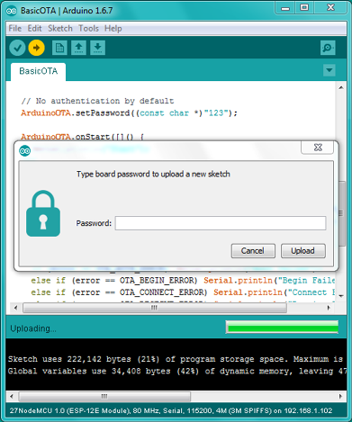
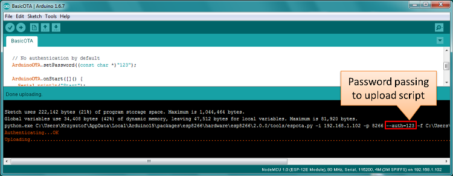
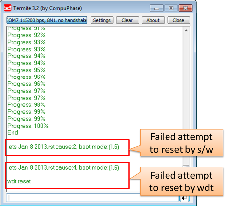

OTA Updates
===========

Introduction
------------

OTA (Over the Air) update is the process of uploading firmware to an ESP module using a Wi-Fi connection rather than a serial port. Such functionality becomes extremely useful in case of limited or no physical access to the module.

OTA may be done using:

-  `Arduino IDE <#arduino-ide>`__
-  `Web Browser <#web-browser>`__
-  `HTTP Server <#http-server>`__

The Arduino IDE option is intended primarily for the software development phase. The other two options would be more useful after deployment, to provide the module with application updates either manually with a web browser, or automatically using an HTTP server.

In any case, the first firmware upload has to be done over a serial port. If the OTA routines are correctly implemented in the sketch, then all subsequent uploads may be done over the air.

By default, there is no imposed security for the OTA process.  It is up to the developer to ensure that updates are allowed only from legitimate / trusted sources. Once the update is complete, the module restarts, and the new code is executed. The developer should ensure that the application running on the module is shut down and restarted in a safe manner. Chapters below provide additional information regarding security and safety of OTA updates.

Security Disclaimer
~~~~~~~~~~~~~~~~~~~

No guarantees as to the level of security provided for your application by the following methods is implied.  Please refer to the GNU LGPL license associated for this project for full disclaimers.  If you do find security weaknesses, please don't hesitate to contact the maintainers or supply pull requests with fixes.  The MD5 verification and password protection schemes are already known to supply a very weak level of security.

Basic Security
~~~~~~~~~~~~~~

The module has to be exposed wirelessly to get it updated with a new sketch. That poses a risk of the module being violently hacked and programmed with some other code. To reduce the likelihood of being hacked, consider protecting your uploads with a password, selecting certain OTA port, etc.

Check functionality provided with the `ArduinoOTA <https://github.com/esp8266/Arduino/tree/master/libraries/ArduinoOTA>`__ library that may improve security:

.. code:: cpp

    void setPort(uint16_t port);
    void setHostname(const char* hostname);
    void setPassword(const char* password);

Certain basic protection is already built in and does not require any additional coding by the developer. `ArduinoOTA <https://github.com/esp8266/Arduino/tree/master/libraries/ArduinoOTA>`__ and espota.py use `Digest-MD5 <https://en.wikipedia.org/wiki/Digest_access_authentication>`__ to authenticate uploads. Integrity of transferred data is verified on the ESP side using `MD5 <https://en.wikipedia.org/wiki/MD5>`__ checksum.

Make your own risk analysis and, depending on the application, decide what library functions to implement. If required, consider implementation of other means of protection from being hacked, like exposing modules for uploads only according to a specific schedule, triggering OTA only when the user presses a dedicated “Update” button wired to the ESP, etc.

Advanced Security - Signed Updates
~~~~~~~~~~~~~~~~~~~~~~~~~~~~~~~~~~

While the above password-based security will dissuade casual hacking attempts, it is not highly secure.  For applications where a higher level of security is needed, cryptographically signed OTA updates can be required.  This uses SHA256 hashing in place of MD5 (which is known to be cryptographically broken) and RSA-2048 bit level public-key encryption to guarantee that only the holder of a cryptographic private key can produce signed updates accepted by the OTA update mechanisms.

Signed updates are updates whose compiled binaries are signed with a private key (held by the developer) and verified with a public key (stored in the application and available for all to see).  The signing process computes a hash of the binary code, encrypts the hash with the developer's private key, and appends this encrypted hash (also called a signature) to the binary that is uploaded (via OTA, web, or HTTP server).  If the code is modified or replaced in any way by anyone except the holder of the developer's private key, the signature will not match and the ESP8266 will reject the upload.

Cryptographic signing only protects against tampering with binaries delivered via OTA.  If someone has physical access, they will always be able to flash the device over the serial port.  Signing also does not encrypt anything but the hash (so that it can't be modified), so this does not protect code inside the device: if a user has physical access they can read out your program.

**Securing your private key is paramount.  The same private/public key pair that was used with the original upload must also be used to sign later binaries.  Loss of the private key associated with a binary means that you will not be able to OTA-update any of your devices in the field.  Alternatively, if someone else copies the private key, then they will be able to use it to sign binaries which will be accepted by the ESP.**

Signed Binary Format
^^^^^^^^^^^^^^^^^^^^

The format of a signed binary is compatible with the standard binary format, and can be uploaded to a non-signed ESP8266 via serial or OTA without any conditions.  Note, however, that once an unsigned OTA app is overwritten by this signed version, further updates will require signing.

As shown below, the signed hash is appended to the unsigned binary, followed by the total length of the signed hash (i.e., if the signed hash was 64 bytes, then this uint32 data segment will contain 64).  This format allows for extensibility (such as adding a CA-based validation scheme allowing multiple signing keys all based on a trust anchor). Pull requests are always welcome. (currently it uses SHA256 with RSASSA-PKCS1-V1_5-SIGN signature scheme from RSA PKCS #1 v1.5)

.. code:: bash

    NORMAL-BINARY <SIGNATURE> <uint32 LENGTH-OF-SIGNATURE>

Signed Binary Prerequisites
^^^^^^^^^^^^^^^^^^^^^^^^^^^

OpenSSL is required to run the standard signing steps, and should be available on any UNIX-like or Windows system.  As usual, the latest stable version of OpenSSL is recommended.

Signing requires the generation of an RSA-2048 key (other bit lengths are supported as well, but 2048 is a good selection today) using any appropriate tool.  The following shell commands will generate a new public/private key pair.  Run them in the sketch directory:

.. code:: bash

    openssl genrsa -out private.key 2048
    openssl rsa -in private.key -outform PEM -pubout -out public.key

Automatic Signing -- Only available on Linux and Mac
^^^^^^^^^^^^^^^^^^^^^^^^^^^^^^^^^^^^^^^^^^^^^^^^^^^^

The simplest way of implementing signing is to use the automatic mode, which presently is only possible on Linux and Mac due to some of the tools not being available for Windows.  This mode uses the IDE to configure the source code to enable sigining verification with a given public key, and signs binaries as part of the standard build process using a given public key.

To enable this mode, just include `private.key` and `public.key` in the sketch `.ino` directory.  The IDE will call a helper script (`tools/signing.py`) before the build begins to create a header to enable key validation using the given public key, and to actually do the signing after the build process, generating a `sketch.bin.signed` file.  When OTA is enabled (ArduinoOTA, Web, or HTTP), the binary will automatically only accept signed updates.

When the signing process starts, the message:

.. code:: bash

    Enabling binary signing

will appear in the IDE window before a compile is launched. At the completion of the build, the signed binary file well be displayed in the IDE build window as:

.. code:: bash

    Signed binary: /full/path/to/sketch.bin.signed

If you receive either of the following messages in the IDE window, the signing was not completed and you will need to verify the `public.key` and `private.key`:

.. code:: bash

    Not enabling binary signing
    ... or ...
    Not signing the generated binary

Manual Signing of Binaries
^^^^^^^^^^^^^^^^^^^^^^^^^^

Users may also manually sign executables and require the OTA process to verify their signature.  In the main code, before enabling any update methods, add the following declarations and function call:

.. code:: cpp

    <in globals>
    BearSSL::PublicKey signPubKey( ... key contents ... );
    BearSSL::HashSHA256 hash;
    BearSSL::SigningVerifier sign( &signPubKey );
    ...
    <in setup()>
    Update.installSignature( &hash, &sign );

The above snippet creates a BearSSL public key and a SHA256 hash verifier, and tells the Update object to use them to validate any updates it receives from any method.

Compile the sketch normally and, once a `.bin` file is available, sign it using the signer script:

.. code:: bash

    <ESP8266ArduinoPath>/tools/signing.py --mode sign --privatekey <path-to-private.key> --bin <path-to-unsigned-bin> --out <path-to-signed-binary>

Old And New Signature Formats
^^^^^^^^^^^^^^^^^^^^^^^^^^^^^

Up to version 2.5.2 of the core, the format of signatures was a little different. An additional signed binary with the extension legacy_sig is created. This file contains a signature in the old format and can be uploaded OTA to a device that checks for the old signature format.

To create a legacy signature, call the signing script with --legacy:

.. code:: bash

    <ESP8266ArduinoPath>/tools/signing.py --mode sign --privatekey <path-to-private.key> --bin <path-to-unsigned-bin> --out <path-to-signed-binary> --legacy <path-to-legacy-file>

Compression
-----------

The eboot bootloader incorporates a GZIP decompressor, built for very low code requirements.  For applications, this optional decompression is completely transparent.  For uploading compressed filesystems, the application must be built with `ATOMIC_FS_UPDATE` defined because, otherwise, eboot will not be involved in writing the filesystem.

No changes to the application are required.  The `Updater` class and `eboot` bootloader (which performs actual application overwriting on update) automatically search for the `gzip` header in the uploaded binary, and if found, handle it.

Compress an application `.bin` file or filesystem package using any `gzip` available, at any desired compression level (`gzip -9` is recommended because it provides the maximum compression and uncompresses as fast as any other compressino level).  For example:

.. code:: bash

    gzip -9 sketch.bin  # Maximum compression, output sketch.bin.gz
    <Upload the resultant sketch.bin.gz>

If signing is desired, sign the gzip compressed file *after* compression.

.. code:: bash

    gzip -9 sketch.bin
    <ESP8266ArduinoPath>/tools/signing.py --mode sign --privatekey <path-to-private.key> --bin sketch.bin.gz --out sketch.bin.gz.signed

Updating apps in the field to support compression
~~~~~~~~~~~~~~~~~~~~~~~~~~~~~~~~~~~~~~~~~~~~~~~~~

If you have applications deployed in the field and wish to update them to support compressed OTA uploads, you will need to first recompile the application, then _upload the uncompressed `.bin` file once.  Attempting to upload a `gzip` compressed binary to a legacy app will result in the Updater rejecting the upload as it does not understand the `gzip` format.  After this initial upload, which will include the new bootloader and `Updater` class with compression support, compressed updates can then be used.

Safety
~~~~~~

The OTA process consumes some of the ESP’s resources and bandwidth during upload. Then, the module is restarted and a new sketch executed. Analyse and test how this affects the functionality of the existing and new sketches.

If the ESP is in a remote location and controlling some equipment, you should devote additional attention to what happens if operation of this equipment is suddenly interrupted by the update process. Therefore, decide how to put this equipment into a safe state before starting the update. For instance, your module may be controlling a garden watering system in a sequence. If this sequence is not properly shut down and a water valve is left open, the garden may be flooded.

The following functions are provided with the `ArduinoOTA <https://github.com/esp8266/Arduino/tree/master/libraries/ArduinoOTA>`__ library and intended to handle functionality of your application during specific stages of OTA, or on an OTA error:

.. code:: cpp

    void onStart(OTA_CALLBACK(fn));
    void onEnd(OTA_CALLBACK(fn));
    void onProgress(OTA_CALLBACK_PROGRESS(fn));
    void onError(OTA_CALLBACK_ERROR (fn));

OTA Basic Requirements
~~~~~~~~~~~~~~~~~~~~~~

The flash chip size should be large enough to hold the old sketch (currently running) and the new sketch (OTA) at the same time.

Keep in mind that the file system and EEPROM, for example, need space too; see `Flash layout <../filesystem.rst#flash-layout>`__.

.. code:: cpp

    ESP.getFreeSketchSpace();

can be used for checking the free space available for the new sketch.

For an overview of memory layout, where the new sketch is stored and how it is copied during the OTA process, see `Update process - memory view <#update-process-memory-view>`__.

The following chapters provide more details and specific methods for OTA updates.

Arduino IDE
-----------

Uploading modules wirelessly from Arduino IDE is intended for the following typical scenarios:

-  during firmware development as a quicker alternative to loading over a serial port,

-  for updating a small number of modules,

-  only if modules are accessible on the same network as the computer with the Arduino IDE.

Requirements
~~~~~~~~~~~~

-  The ESP and the computer must be connected to the same network.

Application Example
~~~~~~~~~~~~~~~~~~~

Instructions below show configuration of OTA on a NodeMCU 1.0 (ESP-12E Module) board. You can use any other board that meets the `requirements <#ota-basic-requirements>`__ described above. This instruction is valid for all operating systems supported by the Arduino IDE. Screen captures have been made on Windows 7 and you may see small differences (like name of the serial port), if you are using Linux or MacOS.

1. Before you begin, please make sure that you have the following software
   installed:

   -  Arduino IDE 1.6.7 or newer -
      https://www.arduino.cc/en/Main/Software
   -  esp8266/Arduino platform package 2.0.0 or newer - for instructions
      follow
      https://github.com/esp8266/Arduino#installing-with-boards-manager

2. Now prepare the sketch and configuration for upload via a serial port.

   -  Start Arduino IDE and upload the sketch BasicOTA.ino, available under
      File > Examples > ArduinoOTA |ota sketch selection|

   -  Update the SSID and password in the sketch, so that the module can join
      your Wi-Fi network |ota ssid pass entry|

   -  Configure upload parameters as below (you may need to adjust
      configuration if you are using a different module): |ota serial upload config|

      **Note:** Depending on version of platform package and board you
      have, you may see ``Upload Using:`` in the menu above. This option
      is inactive and it does not matter what you select. It has been
      left for compatibility with older implementation of OTA and
      finally removed in platform package version 2.2.0.

3. Upload the sketch (Ctrl+U). Once done, open Serial Monitor
   (Ctrl+Shift+M) and check if module has joined your Wi-Fi network:

   .. figure:: a-ota-upload-complete-and-joined-wifi.png
      :alt: Check if module joined network

**Note:** The ESP module should be reset after serial upload. Otherwise, subsequent steps will not work. Reset may be done for you automatically after opening serial monitor, as visible on the screenshot above. It depends on how you have DTR and RTS wired from the USB-Serial converter to the ESP. If reset is not done automatically, then trigger it by pressing reset button or manually cycling the power. For more details why this should be done please refer to `FAQ <../faq#i-have-observed-a-case-when-esprestart-doesnt-work-what-is-the-reason-for-that>`__ regarding ``ESP.restart()``.

4. Only if the module is connected to network, after a couple of seconds,
   the esp8266-ota port will show up in Arduino IDE. Select port with IP
   address shown in the Serial Monitor window in previous step:

   .. figure:: a-ota-ota-port-selection.png
      :alt: Selection of OTA port

   **Note:** If the OTA port does not show up, exit Arduino IDE, open it
   again and check if the port is there. If it is not, check your
   firewall and router settings. The OTA port is advertised using mDNS
   service. To check if the port is visible by your PC, you can use
   an application like Bonjour Browser.

5. Now get ready for your first OTA upload by selecting the OTA port:

   .. figure:: a-ota-ota-upload-configuration.png
      :alt: Configuration of OTA upload

   **Note:** The menu entry ``Upload Speed:`` does not matter at this
   point as it concerns the serial port. Just left it unchanged.

6. If you have successfully completed all the above steps, you can
   upload (Ctrl+U) the same (or any other) sketch over OTA:

   .. figure:: a-ota-ota-upload-complete.png
      :alt: OTA upload complete

**Note:** To be able to upload your sketch over and over again using OTA, you need to embed OTA routines inside. Please use BasicOTA.ino as an example.

Password Protection
^^^^^^^^^^^^^^^^^^^

Protecting your OTA uploads with password is really straightforward. All you need to do, is to include the following statement in your code:

.. code:: cpp

    ArduinoOTA.setPassword((const char *)"123");

Where ``123`` is a sample password that you should replace with your own.

Before implementing it in your sketch, it is a good idea to check how it works using *BasicOTA.ino* sketch available under *File > Examples > ArduinoOTA*. Go ahead, open *BasicOTA.ino*, uncomment the above statement that is already there, and upload the sketch. To make troubleshooting easier, do not modify example sketch besides what is absolutely required. This is including original simple ``123`` OTA password. Then attempt to upload sketch again (using OTA). After compilation is complete, once upload is about to begin, you should see prompt for password as follows:

Enter the password and upload should be initiated as usual with the only difference being ``Authenticating...OK`` message visible in upload log.

.. figure:: a-ota-upload-password-authenticating-ok.png
   :alt: Authenticating...OK during OTA upload

You will not be prompted for a reentering the same password next time. Arduino IDE will remember it for you. You will see prompt for password only after reopening IDE, or if you change it in your sketch, upload the sketch and then try to upload it again.

Please note, it is possible to reveal password entered previously in Arduino IDE, if IDE has not been closed since last upload. This can be done by enabling *Show verbose output during: upload* in *File > Preferences* and attempting to upload the module.

The picture above shows that the password is visible in log, as it is passed to *espota.py* upload script.

Another example below shows situation when password is changed between uploads.

.. figure:: a-ota-upload-password-passing-again-upload-ok.png
   :alt: Verbose output when OTA password has been changed between uploads

When uploading, Arduino IDE used previously entered password, so the upload failed and that has been clearly reported by IDE. Only then IDE prompted for a new password. That was entered correctly and second attempt to upload has been successful.

Troubleshooting
^^^^^^^^^^^^^^^

If OTA update fails, first step is to check for error messages that may be shown in upload window of Arduino IDE. If this is not providing any useful hints, try to upload again while checking what is shown by ESP on serial port. Serial Monitor from IDE will not be useful in that case. When attempting to open it, you will likely see the following:

.. figure:: a-ota-network-terminal.png
   :alt: Arduino IDE network terminal window

This window is for Arduino Yún and not yet implemented for esp8266/Arduino. It shows up because IDE is attempting to open Serial Monitor using network port you have selected for OTA upload.

Instead you need an external serial monitor. If you are a Windows user check out `Termite <https://www.compuphase.com/software_termite.htm>`__. This is handy, slick and simple RS232 terminal that does not impose RTS or DTR flow control. Such flow control may cause issues if you are using respective lines to toggle GPIO0 and RESET pins on ESP for upload.

Select COM port and baud rate on external terminal program as if you were using Arduino Serial Monitor. Please see typical settings for `Termite <https://www.compuphase.com/software_termite.htm>`__ below:

.. figure:: termite-configuration.png
   :alt: Termite settings

Then run OTA from IDE and look what is displayed on terminal. Successful `ArduinoOTA <#arduino-ide>`__ process using BasicOTA.ino sketch looks like below (IP address depends on your network configuration):

.. figure:: a-ota-external-serial-terminal-output.png
   :alt: OTA upload successful - output on an external serial terminal

If upload fails you will likely see errors caught by the uploader, exception and the stack trace, or both.

Instead of the log as on the above screen you may see the following:

If this is the case, then most likely ESP module has not been reset after initial upload using serial port.

The most common causes of OTA failure are as follows:

- not enough physical memory on the chip (e.g. ESP01 with 512K flash memory is not enough for OTA).
- too much memory declared for the filesystem so new sketch will not fit between existing sketch and the filesystem – see `Update process - memory view <#update-process-memory-view>`__.
- too little memory declared in Arduino IDE for your selected board (i.e. less than physical size).
- not resetting the ESP module after initial upload using serial port.

For more details regarding flash memory layout please check `File system <../filesystem.rst>`__. For overview where new sketch is stored, how it is copied and how memory is organized for the purpose of OTA see `Update process - memory view <#update-process-memory-view>`__.

Web Browser
-----------

Updates described in this chapter are done with a web browser that can be useful in the following typical scenarios:

-  after application deployment if loading directly from Arduino IDE is
   inconvenient or not possible,
-  after deployment if user is unable to expose module for OTA from
   external update server,
-  to provide updates after deployment to small quantity of modules when
   setting an update server is not practicable.

Requirements
~~~~~~~~~~~~

-  The ESP and the computer must be connected to the same network.

Implementation Overview
~~~~~~~~~~~~~~~~~~~~~~~

Updates with a web browser are implemented using ``ESP8266HTTPUpdateServer`` class together with ``ESP8266WebServer`` and ``ESP8266mDNS`` classes. The following code is required to get it work:

setup()

.. code:: cpp

        MDNS.begin(host);

        httpUpdater.setup(&httpServer);
        httpServer.begin();

        MDNS.addService("http", "tcp", 80);

loop()

.. code:: cpp

        httpServer.handleClient();

Application Example
~~~~~~~~~~~~~~~~~~~

The sample implementation provided below has been done using:

-  example sketch WebUpdater.ino available in
   ``ESP8266HTTPUpdateServer`` library,
-  NodeMCU 1.0 (ESP-12E Module).

You can use another module if it meets previously described `requirements <#ota-basic-requirements>`__.

1. Before you begin, please make sure that you have the following
   software installed:

   -  Arduino IDE and 2.0.0-rc1 (of Nov 17, 2015) version of platform
      package as described under
      https://github.com/esp8266/Arduino#installing-with-boards-manager
   -  Host software depending on O/S you use:

      1. Avahi https://avahi.org/ for Linux
      2. Bonjour https://www.apple.com/support/bonjour/ for Windows
      3. Mac OSX and iOS - support is already built in / no any extra
         s/w is required

2. Prepare the sketch and configuration for initial upload with a serial
   port.

   -  Start Arduino IDE and load sketch WebUpdater.ino available under
      File > Examples > ESP8266HTTPUpdateServer.
   -  Update SSID and password in the sketch, so the module can join
      your Wi-Fi network.
   -  Open File > Preferences, look for “Show verbose output during:”
      and check out “compilation” option.

      .. figure:: ota-web-show-verbose-compilation.png
         :alt: Preferences - enabling verbose output during compilation

      **Note:** This setting will be required in step 5 below. You can
      uncheck this setting afterwards.

3. Upload sketch (Ctrl+U). Once done, open Serial Monitor (Ctrl+Shift+M)
   and check if you see the following message displayed, that contains
   url for OTA update.

   .. figure:: ota-web-serial-monitor-ready.png
      :alt: Serial Monitor - after first load using serial

   **Note:** Such message will be shown only after module successfully
   joins network and is ready for an OTA upload. Please remember about
   resetting the module once after serial upload as discussed in chapter
   `Arduino IDE <#arduino-ide>`__, step 3.

4. Now open web browser and enter the url provided on Serial Monitor,
   i.e. ``http://esp8266-webupdate.local/update``. Once entered, browser
   should display a form like below that has been served by your module.
   The form invites you to choose a file for update.

   .. figure:: ota-web-browser-form.png
      :alt: OTA update form in web browser

   **Note:** If entering ``http://esp8266-webupdate.local/update`` does
   not work, try replacing ``esp8266-webupdate`` with module’s IP
   address. For example, if your module IP is ``192.168.1.100`` then url
   should be ``http://192.168.1.100/update``. This workaround is useful
   in case the host software installed in step 1 does not work. If still
   nothing works and there are no clues on the Serial Monitor, try to
   diagnose issue by opening provided url in Google Chrome, pressing F12
   and checking contents of “Console” and “Network” tabs. Chrome
   provides some advanced logging on these tabs.

5. To obtain the file, navigate to directory used by Arduino IDE to
   store results of compilation. You can check the path to this file in
   compilation log shown in IDE debug window as marked below.

   .. figure:: ota-web-path-to-binary.png
      :alt: Compilation complete - path to binary file

6. Now press “Choose File” in web browser, go to directory identified in
   step 5 above, find the file “WebUpdater.cpp.bin” and upload it. If
   upload is successful, you will see “OK” on web browser like below.

   .. figure:: ota-web-browser-form-ok.png
      :alt: OTA update complete

   Module will reboot that should be visible on Serial Monitor:

   .. figure:: ota-web-serial-monitor-reboot.png
      :alt: Serial Monitor - after OTA update

   Just after reboot you should see exactly the same message
   ``HTTPUpdateServer ready! Open http://esp8266-webupdate.local/update in your browser``
   like in step 3. This is because module has been loaded again with the
   same code – first using serial port, and then using OTA.

Once you are comfortable with this procedure, go ahead and modify WebUpdater.ino sketch to print some additional messages, compile it, locate new binary file and upload it using web browser to see entered changes on a Serial Monitor.

You can also add OTA routines to your own sketch following guidelines in `Implementation Overview <#implementation-overview>`__ above. If this is done correctly, you should be always able to upload new sketch over the previous one using a web browser.

In case OTA update fails dead after entering modifications in your sketch, you can always recover module by loading it over a serial port. Then diagnose the issue with sketch using Serial Monitor. Once the issue is fixed try OTA again.

HTTP Server
-----------

``ESP8266HTTPUpdate`` class can check for updates and download a binary file from HTTP web server. It is possible to download updates from every IP or domain address on the network or Internet.

Note that by default this class closes all other connections except the one used by the update, this is because the update method blocks. This means that if there's another application receiving data then TCP packets will build up in the buffer leading to out of memory errors causing the OTA update to fail. There's also a limited number of receive buffers available and all may be used up by other applications.

There are some cases where you know that you won't be receiving any data but would still like to send progress updates.
It's possible to disable the default behaviour (and keep connections open) by calling closeConnectionsOnUpdate(false).

Requirements
~~~~~~~~~~~~

-  web server

Arduino code
~~~~~~~~~~~~

Simple updater
^^^^^^^^^^^^^^

Simple updater downloads the file every time the function is called.

.. code:: cpp

    #include <ESP8266httpUpdate.h>
    
    WiFiClient client;
    ESPhttpUpdate.update(client, "192.168.0.2", 80, "/arduino.bin");

Advanced updater
^^^^^^^^^^^^^^^^

Its possible to point the update function to a script on the server. If a version string argument is given, it will be sent to the server. The server side script can use this string to check whether an update should be performed.

The server-side script can respond as follows: - response code 200, and send the firmware image, - or response code 304 to notify ESP that no update is required.

.. code:: cpp

    #include <ESP8266httpUpdate.h>
    
    WiFiClient client;
    t_httpUpdate_return ret = ESPhttpUpdate.update(client, "192.168.0.2", 80, "/esp/update/arduino.php", "optional current version string here");
    switch(ret) {
        case HTTP_UPDATE_FAILED:
            Serial.println("[update] Update failed.");
            break;
        case HTTP_UPDATE_NO_UPDATES:
            Serial.println("[update] Update no Update.");
            break;
        case HTTP_UPDATE_OK:
            Serial.println("[update] Update ok."); // may not be called since we reboot the ESP
            break;
    }

TLS updater
^^^^^^^^^^^

Please read and try the examples provided with the library.

Server request handling
~~~~~~~~~~~~~~~~~~~~~~~

Simple updater
^^^^^^^^^^^^^^

For the simple updater the server only needs to deliver the binary file for update.

Advanced updater
^^^^^^^^^^^^^^^^

For advanced update management a script (such as a PHP script) needs to run on the server side. On every update request, the ESP sends some information in HTTP headers to the server.

Example header data:

::

        [User-Agent] => ESP8266-http-Update
        [x-ESP8266-STA-MAC] => 18:FE:AA:AA:AA:AA
        [x-ESP8266-AP-MAC] => 1A:FE:AA:AA:AA:AA
        [x-ESP8266-free-space] => 671744
        [x-ESP8266-sketch-size] => 373940
        [x-ESP8266-sketch-md5] => a56f8ef78a0bebd812f62067daf1408a
        [x-ESP8266-chip-size] => 4194304
        [x-ESP8266-sdk-version] => 1.3.0
        [x-ESP8266-version] => DOOR-7-g14f53a19
        [x-ESP8266-mode] => sketch

With this information the script now can check if an update is needed. It is also possible to deliver different binaries based on the MAC address, as in the following example:

.. code:: php

    <?PHP

    function check_header($name, $value = false) {
        global $headers;
        if (!isset($headers[$name])) {
            return false;
        }
        if ($value && $headers[$name] != $value) {
            return false;
        }
        return true;
    }
    
    function sendFile($path, $version) {
        header($_SERVER["SERVER_PROTOCOL"].' 200 OK', true, 200);
        header('Content-Type: application/octet-stream', true);
        header('Content-Disposition: attachment; filename='.basename($path));
        header('Content-Length: '.filesize($path), true);
        header('x-MD5: '.md5_file($path), true);
        header('x-version: '.$version, true);
        readfile($path);
    }
    
    
    $headers = getallheaders();
    
    header('Content-type: text/plain; charset=utf8', true);
    
    //if (!check_header('HTTP_USER_AGENT', 'ESP8266-http-Update')) {
    if (!check_header('User-Agent', 'ESP8266-http-Update')) {
        header($_SERVER["SERVER_PROTOCOL"].' 403 Forbidden', true, 403);
        echo "Only for ESP8266 updater!\n";
        echo "User-Agent: ".$headers['User-Agent']." != ESP8266-http-Update\n";
        exit();
    }
    
    if (
        !check_header('x-ESP8266-mode') ||
        !check_header('x-ESP8266-STA-MAC') ||
        !check_header('x-ESP8266-AP-MAC') ||
        !check_header('x-ESP8266-free-space') ||
        !check_header('x-ESP8266-sketch-size') ||
        !check_header('x-ESP8266-sketch-md5') ||
        !check_header('x-ESP8266-chip-size') ||
        !check_header('x-ESP8266-sdk-version')
    ) {
        header($_SERVER["SERVER_PROTOCOL"].' 403 Forbidden', true, 403);
        echo "Only for ESP8266 updater! (header missing)\n";
        exit();
    }
    
    $db_string = '{
        "18:FE:AA:AA:AA:AA": {"file": "DOOR-7-g14f53a19.bin", "version": 1},
        "18:FE:AA:AA:AA:BB": {"file": "TEMP-1.0.0".bin", "version": 1}}';
    // $db_string = file_get_contents("arduino-db.json");
    $db = json_decode($db_string, true);
    $mode = $headers['x-ESP8266-mode'];
    $mac = $headers['x-ESP8266-STA-MAC'];
    
    if (!isset($db[$mac])) {
        header($_SERVER["SERVER_PROTOCOL"].' 404 ESP MAC not configured for updates', true, 404);
        echo "MAC ".$mac." not configured for updates\n";
        exit();
    }
    
    $localBinary = $db[$mac]['file'];
    $localVersion = $db[$mac]['version'];
    
    if (!is_readable($localBinary)) {
        header($_SERVER["SERVER_PROTOCOL"].' 404 File not found', true, 404);
        echo "File ".$localBinary." not found\n";
        exit();
    }
    
    if ($mode == 'sketch') {
        // Check if version has been set and does not match, if not, check if
        // MD5 hash between local binary and ESP8266 binary do not match if not.
        // then no update has been found.
        if ((check_header('x-ESP8266-version') && $headers['x-ESP8266-version'] != $localVersion)) {
            // || $headers["x-ESP8266-sketch-md5"] != md5_file($localBinary)) {
            sendFile($localBinary, $localVersion);
        } else {
            header($_SERVER["SERVER_PROTOCOL"].' 304 Not Modified', true, 304);
            echo "File ".$localBinary." not modified\n";
        }
    } else if ($mode == 'version') {
        header($_SERVER["SERVER_PROTOCOL"].' 200 OK', true, 200);
        header('x-MD5: '.md5_file($localBinary), true);
        header('x-version: '.$localVersion, true);
    } else {
        header($_SERVER["SERVER_PROTOCOL"].' 404 Mode not supported', true, 404);
        echo "mode: ".$mode." not supported\n";
        exit();
    }
    ?>

Stream Interface
----------------

The Stream Interface is the base for all other update modes like OTA, HTTP Server / client. Given a Stream-class variable `streamVar` providing `byteCount` bytes of firmware, it can store the firmware as follows:

.. code:: cpp

    Update.begin(firmwareLengthInBytes);
    Update.writeStream(streamVar);
    Update.end();

Updater class
-------------

Updater is in the Core and deals with writing the firmware to the flash, checking its integrity and telling the bootloader (eboot) to load the new firmware on the next boot.

The following `Updater <https://github.com/esp8266/Arduino/tree/master/cores/esp8266/Updater.h` methods could be used to be notified about OTA progress:

.. code:: cpp

    using THandlerFunction_Progress = std::function<void(size_t, size_t)>;
    void onProgress(THandlerFunction_Progress); // current and total number of bytes

    using THandlerFunction_Error = std::function<void(uint8_t)>;
    void onStart(THandlerFunction_Error); // error code

    using THandlerFunction = std::function<void()>;
    void onEnd(THandlerFunction);
    void onError(THandlerFunction);

Using RTC memory
~~~~~~~~~~~~~~~~

The bootloader command will be stored into the first 128 bytes of user RTC memory, then it will be retrieved by eboot on boot. That means that user data present there will be lost `(per discussion in #5330) <https://github.com/esp8266/Arduino/pull/5330#issuecomment-437803456>`__.

Flash mode and size
~~~~~~~~~~~~~~~~~~~

For uncompressed firmware images, the Updater will change the flash mode bits if they differ from the flash mode the device is currently running at. This ensures that the flash mode is not changed to an incompatible mode when the device is in a remote or hard to access area. Compressed images are not modified, thus changing the flash mode in this instance could result in damage to the ESP8266 and/or flash memory chip or your device no longer be accessible via OTA, and requiring re-flashing via a serial connection `(per discussion in #7307) <https://github.com/esp8266/Arduino/issues/7307#issuecomment-631523053>`__.

Update process - memory view
~~~~~~~~~~~~~~~~~~~~~~~~~~~~

-  The new sketch will be stored in the space between the old sketch and
   the spiff.
-  on the next reboot, the "eboot" bootloader checks for commands.
-  the new sketch is now copied "over" the old one.
-  the new sketch is started.

By default, OTA filesystem updates overwrite the target flash directly. This can lead to the file system being corrupted if there is a power outage during the update process. In order to use the same two step process that is used for OTA application firmware updates, set the `ATOMIC_FS_UPDATE` flag. Note that you will need to have enough unused space for the new filesystem image to be stored, hence is why this is not the default behaviour.

.. figure:: update_memory_copy.png
   :alt: Memory layout for OTA updates

.. |ota sketch selection| image:: a-ota-sketch-selection.png
.. |ota ssid pass entry| image:: a-ota-ssid-pass-entry.png
.. |ota serial upload config| image:: a-ota-serial-upload-configuration.png

